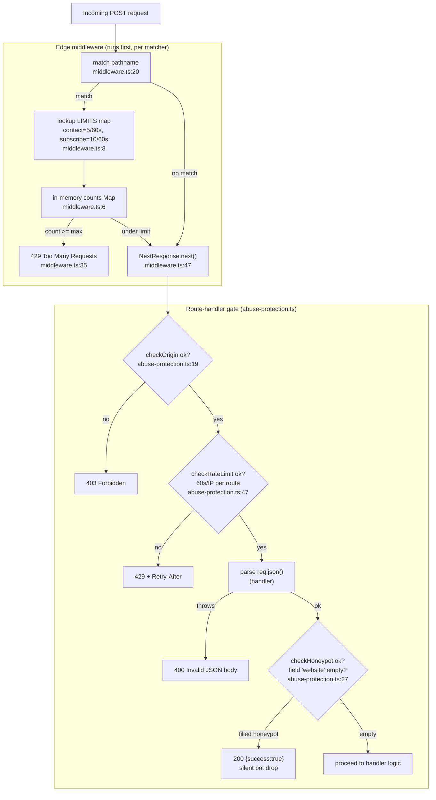
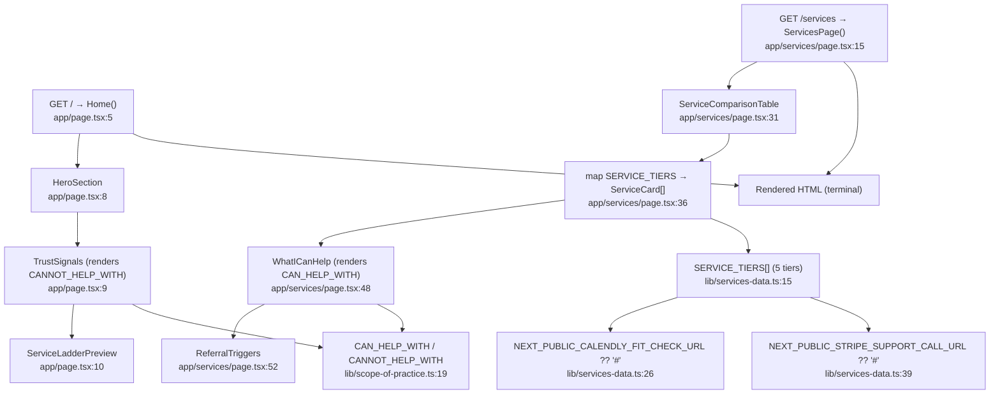
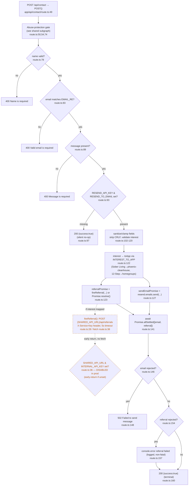
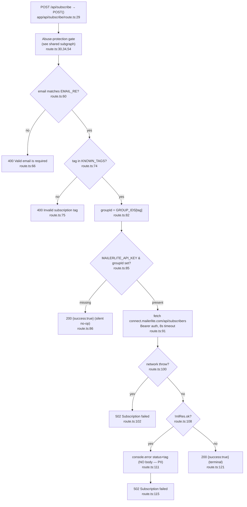
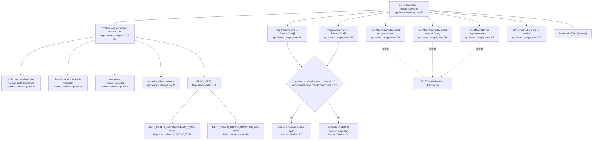
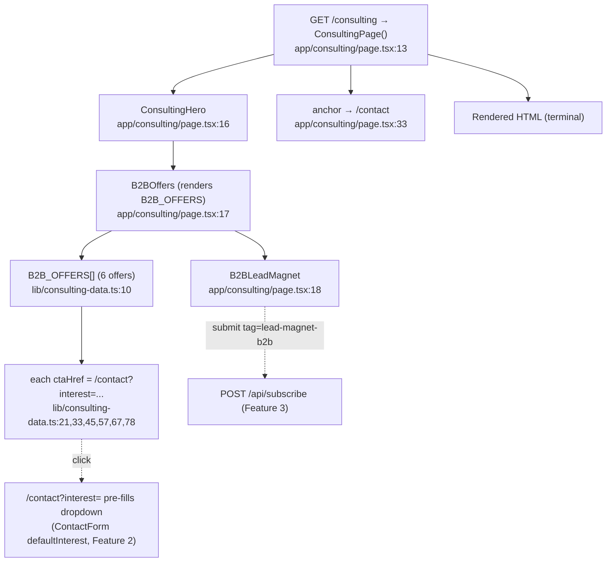
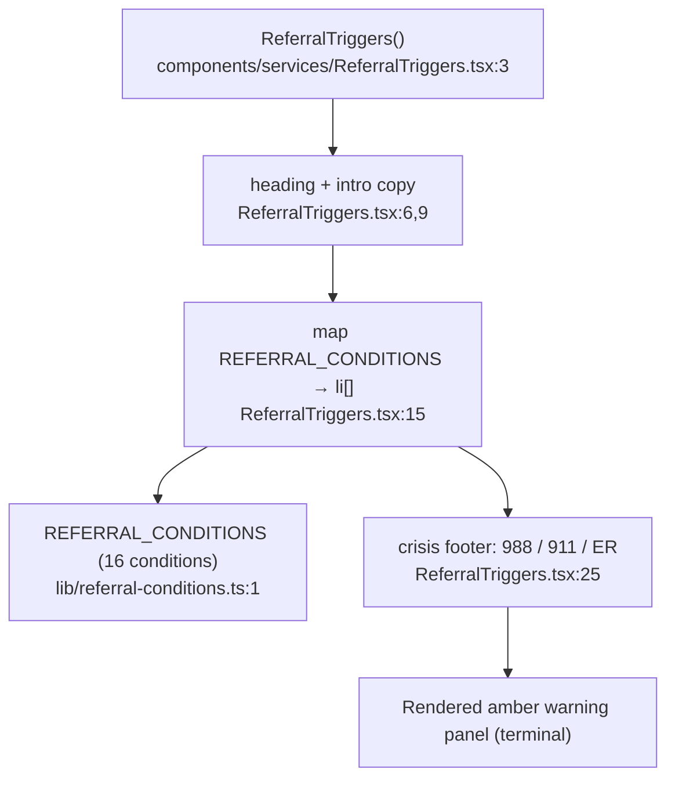
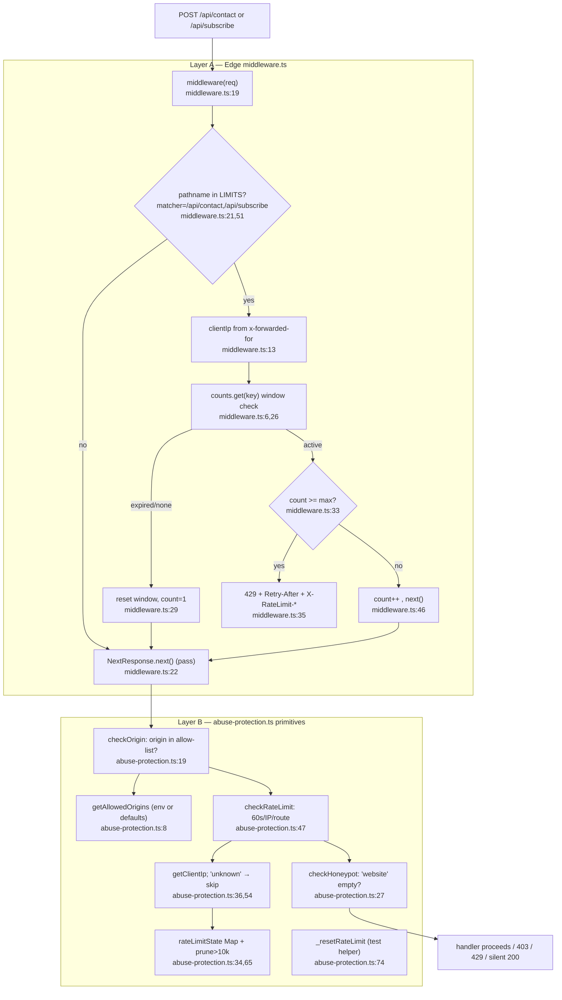

# detox-recovery — Feature Flowcharts

Next.js 15 App Router marketing + lead-capture site (`nextstep-recovery`). All node labels are `Name file:line` with verified line numbers. File paths are relative to `detox-recovery/`.

---

## Shared Upstream Gate: Abuse-Protection Pipeline

Both POST routes (`/api/contact`, `/api/subscribe`) run an identical 3-stage gate before any handler logic, plus a separate edge-middleware rate limiter. This subgraph is referenced by features 2 and 3.

**Side effects / state:**

- In-memory `counts` Map in `middleware.ts:6` (sliding window, single-instance only).
- In-memory `rateLimitState` Map in `abuse-protection.ts:34` (60s window/IP/route; self-prunes at >10k entries, `abuse-protection.ts:65`).
- Origin allow-list read from `process.env.ALLOWED_ORIGINS` else defaults (`abuse-protection.ts:9`).
- `getClientIp` reads `x-forwarded-for` / `x-real-ip`; `"unknown"` skips rate limit (`abuse-protection.ts:54`).

**External deps:** none (pure in-process).

---

## Feature 1: Marketing Pages / Service Ladder

Static server-rendered pages. No runtime data fetching — all content is typed constants imported at build/render time.

**Side effects / state:** none at request time. CTA hrefs resolved from `NEXT_PUBLIC_*` env vars at module load with `?? "#"` fallback (`lib/services-data.ts:26,39,40`).

**External deps:** Calendly + Stripe URLs (static redirect links, not SDK calls). No network I/O during render.

---

## Feature 2: Contact / Lead Capture

`POST /api/contact`. Runs the shared gate, validates fields, sends email via Resend, and conditionally fires a recovery-api referral in parallel. **The referral fetch path is functionally present in code but inert in production** (env vars commented out in `apphosting.yaml`).

**Disabled referral firing (key finding):**

- Function `fireReferral` defined at `app/api/contact/route.ts:28`; the actual outbound `fetch` to `${SHARED_API_URL}/api/referrals` is at `app/api/contact/route.ts:38`.
- It is gated by `if (!url || !key) return;` at `app/api/contact/route.ts:36` — `SHARED_API_URL` / `INTERNAL_API_KEY` are commented out in `apphosting.yaml`, so in production it early-returns and **never fires** (inert).
- Dispatch mechanism is **`Promise.allSettled`** (NOT fire-and-forget): `const [emailResult, referralResult] = await Promise.allSettled([sendEmailPromise, referralPromise])` at `app/api/contact/route.ts:141`. The code comment at `route.ts:137-140` explicitly forbids refactoring to `void fireReferral(...)` because Cloud Run throttles background CPU after handler return.
- Only the `"Sober Living / Housing"` and `"12-Step / Homegroup Support"` interests map to a `toApp` (`route.ts:23-26`); all other interests yield `Promise.resolve()` (`route.ts:125`).

**Side effects / state:**

- Outbound Resend email send (`route.ts:127`).
- Conditional outbound fetch to recovery-api (`route.ts:38`, disabled).
- Env reads: `RESEND_API_KEY`, `RESEND_TO_EMAIL` (`route.ts:93-94`), `RESEND_FROM_EMAIL` (`route.ts:129`), `SHARED_API_URL`, `INTERNAL_API_KEY` (`route.ts:34-35`).
- Shared in-memory rate-limit state (see gate).
- Client driver: `ContactForm` POSTs JSON incl. honeypot `website` (`components/contact/ContactForm.tsx:74`).

**External deps:** Resend (`resend` SDK, `route.ts:2`), recovery-api `/api/referrals` (disabled).

---

## Feature 3: Newsletter / Subscribe (MailerLite)

`POST /api/subscribe`. Same upstream gate, then validates email + tag, maps tag → MailerLite group ID, and POSTs to MailerLite.

**Side effects / state:**

- Outbound fetch to MailerLite (`route.ts:91`).
- Env reads: `MAILERLITE_API_KEY` (`route.ts:83`), group IDs `MAILERLITE_GROUP_ID_NEWSLETTER` / `_LEAD_MAGNET_UNSAFE` / `_LEAD_MAGNET_FAMILY` / `_B2B` (`route.ts:21-27`).
- Deliberately logs status + tag only, never response body, to avoid PII leak (`route.ts:109-111`).
- Shared in-memory rate-limit state (see gate).
- Client driver: `LeadMagnetForm` POSTs `{email, tag, website}` (`components/resources/LeadMagnetForm.tsx:34`).

**External deps:** MailerLite REST API (`connect.mailerlite.com`).

---

## Feature 4: Resources / Products (Lemon Squeezy)

Static page. Partitions `PRODUCTS` into paid / free / newsletter / donation buckets at module load, renders cards. Paid PDFs link to Lemon Squeezy checkout URLs (plain hrefs, no SDK).

**Side effects / state:** none at request time. Lemon Squeezy + Stripe-donation URLs resolved from `NEXT_PUBLIC_*` env at module load with `?? "#"` fallback. The 5 paid PDFs render as disabled "Available soon" when `availability === "coming-soon"` (`ProductCard.tsx:11`). Embedded `LeadMagnetForm`s feed Feature 3.

**External deps:** Lemon Squeezy checkout (static redirect link), Stripe donation link (static). No SDK / network during render.

---

## Feature 5: B2B Consulting

Static page. Renders consulting hero, offers grid, and a B2B lead magnet form. Each offer CTA deep-links to `/contact?interest=...`, pre-filling the contact form.

**Side effects / state:** none at request time. `B2BLeadMagnet` form submits to `/api/subscribe` (Feature 3) with `tag=lead-magnet-b2b`. Offer CTAs route to `/contact?interest=` which pre-fills `ContactForm` (Feature 2).

**External deps:** none during render (downstream subscribe → MailerLite).

---

## Feature 6: Referral Safety Triggers

Pure presentational client-safe component. Renders the hard-coded clinical-safety list that always points users to emergency/medical care — never to site services. Embedded on `/services` (Feature 1).

**Side effects / state:** none. Read-only render of a frozen `as const` array (`lib/referral-conditions.ts:1-18`). Editing the array is a clinical-safety change.

**External deps:** none.

---

## Feature 7: Abuse-Protection / Security Pipeline

The pipeline itself, as a standalone feature. Two layers: (a) Next.js edge `middleware.ts` rate limiter scoped to the two API routes, (b) the in-handler `abuse-protection.ts` primitives. Both layers maintain independent in-memory state.

**Side effects / state:**

- `middleware.ts:6` `counts` Map — per-pathname+IP sliding window (`{count, resetAt}`), single-instance.
- `abuse-protection.ts:34` `rateLimitState` Map — per-IP+route last-hit timestamp, 60s window, self-prunes at >10k (`abuse-protection.ts:65`).
- Origin allow-list from `ALLOWED_ORIGINS` env or `DEFAULT_ALLOWED_ORIGINS` (`abuse-protection.ts:1,9`).
- `_resetRateLimit()` test-only state reset (`abuse-protection.ts:74`).
- Note: two independent rate limiters exist (edge middleware 5/10 per min by path+IP, plus handler `checkRateLimit` 1 per 60s per IP+route). Both run on every contact/subscribe POST.

**External deps:** none (entirely in-process).

---

### Cross-feature notes

- Contact route referral firing is the only path with cross-product (recovery-api) intent, and it is currently inert.
- Forms (Contact, LeadMagnet x3, B2BLeadMagnet) all include `<HoneypotInput name="website">` (`components/forms/HoneypotInput.tsx:8`) feeding the honeypot gate.
- No database / CMS: all page content is typed constants in `lib/*-data.ts`.
