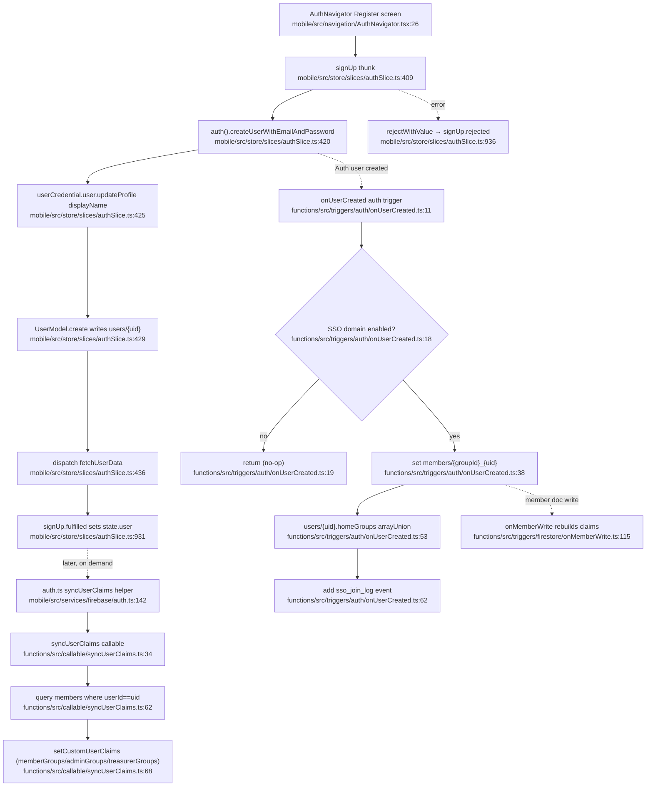
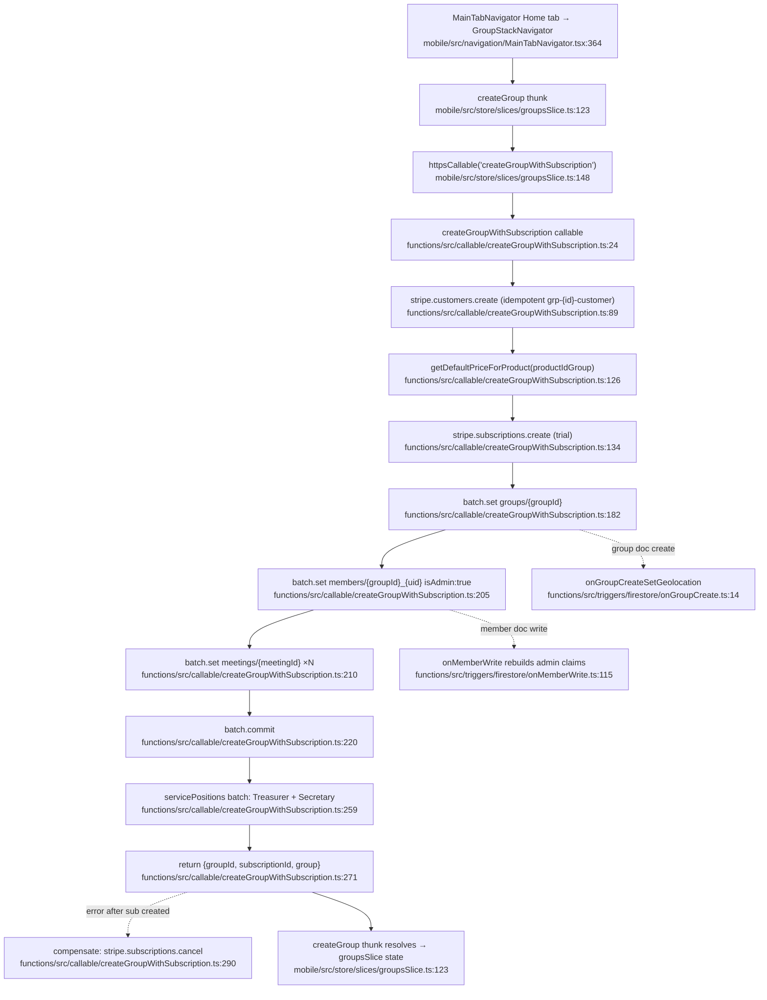
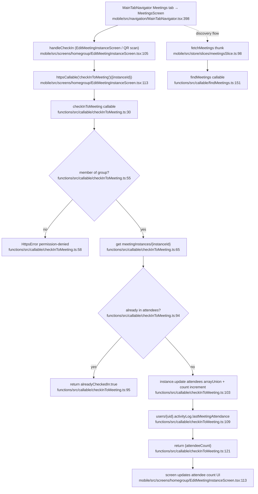
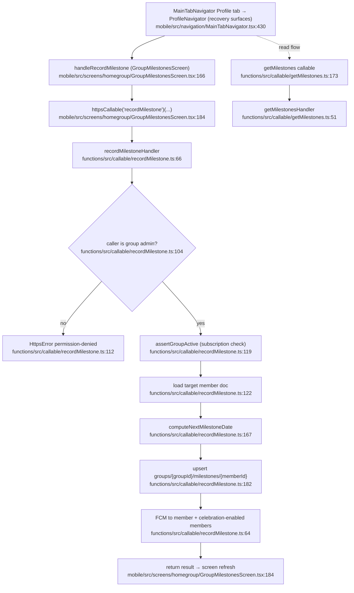
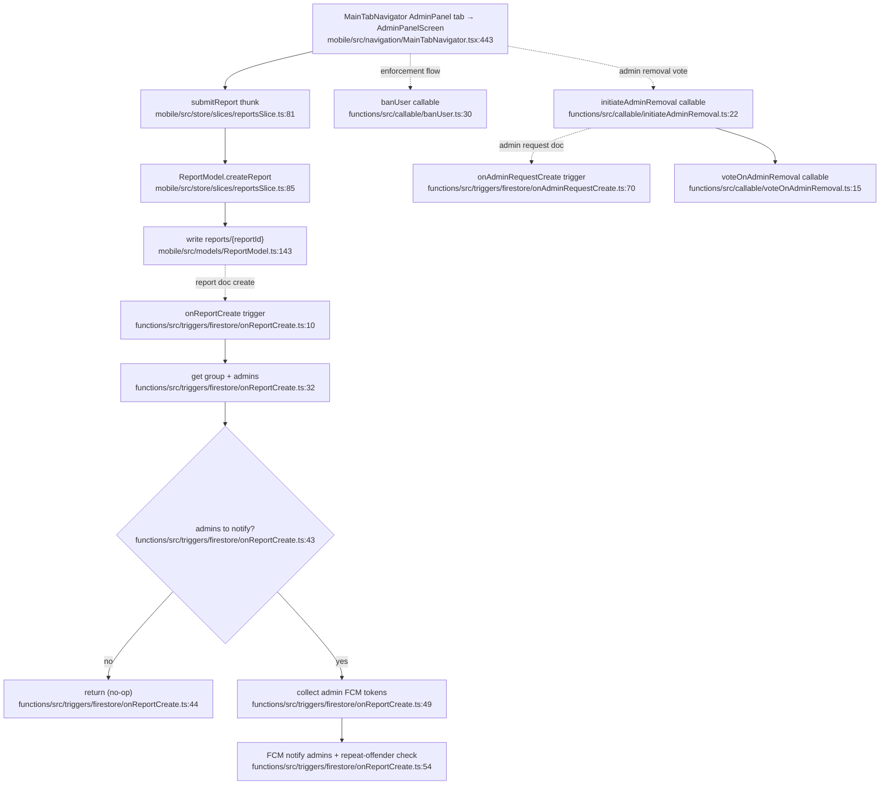
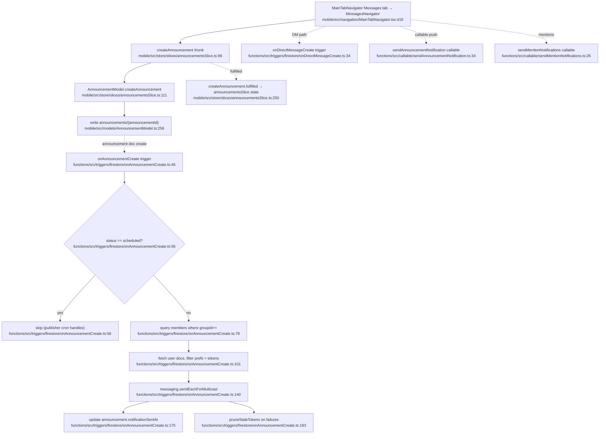

# Homegroups — CORE cluster flowcharts

Product: Homegroups — React Native mobile + Firebase Functions. Firebase project `recovery-connect-cad4b`.
Each diagram traces the single most representative happy path per feature. All node labels carry a verified `file:line`.

Path conventions: mobile files under `mobile/src/`, functions under `functions/src/`.

---

## Authentication & Onboarding

Primary happy path: **email sign-up**. Screen creates the Firebase Auth user + Firestore user doc; the `onUserCreated` auth trigger fires for SSO auto-join; `syncUserClaims` is the on-demand claims refresh.

**External deps:**

- Firebase Auth (`createUserWithEmailAndPassword`, `setCustomUserClaims`).
- Firestore writes: `users/{uid}`, `members/{groupId}_{uid}`, `sso_join_log/{intergroupId}/events`.
- Claims change: `onMemberWrite` and `syncUserClaims` both call `setCustomUserClaims` (1000-byte limit; rules fall back to doc reads when exceeded).
- No FCM, no Stripe on this path. SSO auto-join is gated on the `sso_domain_index/{domain}` doc.

---

## Group Management & Governance

Primary happy path: **create a group with subscription** (`createGroupWithSubscription`). Touches Stripe (customer + subscription), batches group/member/meeting writes, then `onMemberWrite` syncs admin claims and `onGroupCreate*` triggers run geo/meeting side effects.

**External deps:**

- **Stripe**: customer + flat-rate $12/yr subscription (`productIdGroup`, runtime price via `getDefaultPriceForProduct`). Compensating cancel on Firestore failure.
- Firestore writes: `groups/{groupId}`, `members/{groupId}_{uid}`, `meetings/{meetingId}`, `groups/{groupId}/servicePositions/*`.
- Claims change: `onMemberWrite` grants admin claim to creator.
- `onGroupCreateSetGeolocation` geocodes the group (`onGroupCreateFetchMeetings` is the commented-out sibling). Governance callables (`castElectionVote.ts:28`, `castConscienceVote.ts:27`, `ratifyBylaws.ts:30`, `joinGroupByInviteCode.ts:14`) are secondary flows off the same group entity.

---

## Meetings & Attendance / QR Check-in

Primary happy path: **QR / attendance check-in** (`checkInToMeeting`). A secretary's QR deep link (or the Edit Meeting Instance screen) calls the callable; it verifies membership, atomically adds the attendee, and stamps activity.

**External deps:**

- Firestore writes: `meetingInstances/{instanceId}` (`attendees` arrayUnion, `attendeeCount` increment), `users/{uid}.activityLog`. Composite index on `meetingInstances` (groupId, attendees CONTAINS, scheduledAt).
- Auth required; membership enforced via `members/{groupId}_{uid}`. QR deep link is unsigned (trust model: members trusted within group).
- No FCM/Stripe on this path. Sibling callables: `recordCheckIn.ts:18`, `searchGroupsByLocation.ts:36`; HTTP `getMeetingAttendance.ts:108` (Regroup bearer-token export), `googlePlacesProxy.ts:47` (Places lookup for discovery).

---

## Recovery Tracking

Primary happy path: **record a milestone / sobriety chip** (`recordMilestone`). Admin records a chip for a member from the milestones screen; callable verifies admin + active subscription, upserts the milestone doc, then notifies via FCM.

**External deps:**

- Firestore writes: `groups/{groupId}/milestones/{memberId}` (arrayUnion of milestone records + nextMilestone fields).
- **FCM**: push to the member and to opted-in group members (celebrations).
- Stripe (indirect): `assertGroupActive` blocks recording when the group subscription is inactive.
- Sibling recovery callables: `getMilestones.ts:173`, `grantSponsorStepAccess.ts:139` (sponsorshipSlice / stepWorkSlice / reflectionsSlice are local step-work + reflection state, no callable on the chip path).

---

## Moderation & Admin

Primary happy path: **submit a report**, fanning out to the `onReportCreate` trigger which notifies group admins via FCM.

**External deps:**

- Firestore writes: `reports/{reportId}`.
- **FCM**: push to group admins on new report.
- Sibling moderation callables: `banUser.ts:30`, `setUserAsSuperAdmin.ts:16` (super-admin claim change), `initiateAdminRemoval.ts:22` + `voteOnAdminRemoval.ts:15` (governance vote, fanning through `onAdminRequestCreate.ts:70`).

---

## Messaging & Announcements

Primary happy path: **create a group announcement**, fanning out through `onAnnouncementCreate` which sends FCM to all eligible members and stamps `notificationSentAt`.

**External deps:**

- Firestore writes: `announcements/{announcementId}` (create + `notificationSentAt` stamp).
- **FCM**: `sendEachForMulticast` to all eligible group members (respects `notificationSettings.announcements` + `allowPushNotifications`); `pruneStaleTokens` (`functions/src/utils/fcm.ts`) cleans dead tokens.
- `notificationSentAt` is the de-dup guard so the `sendAnnouncementNotification.ts:34` callable won't double-send. Sibling messaging flows: `onDirectMessageCreate.ts:34` (DM push, chatSlice/directMessagesSlice), `sendMentionNotifications.ts:26` (mention push).
