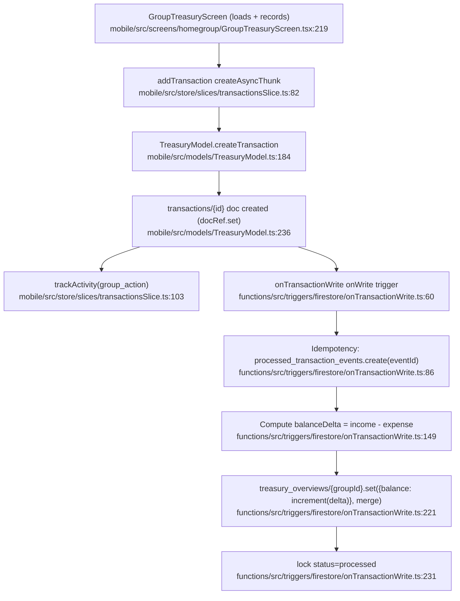
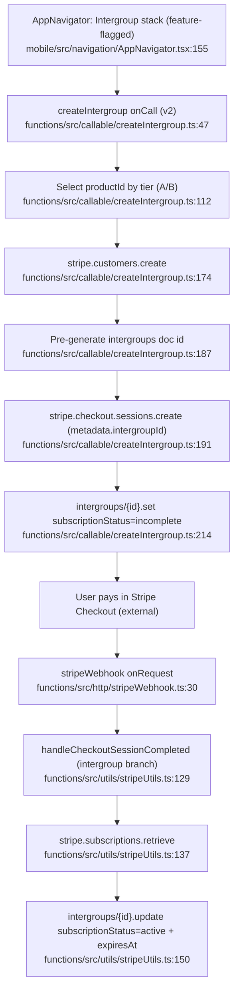
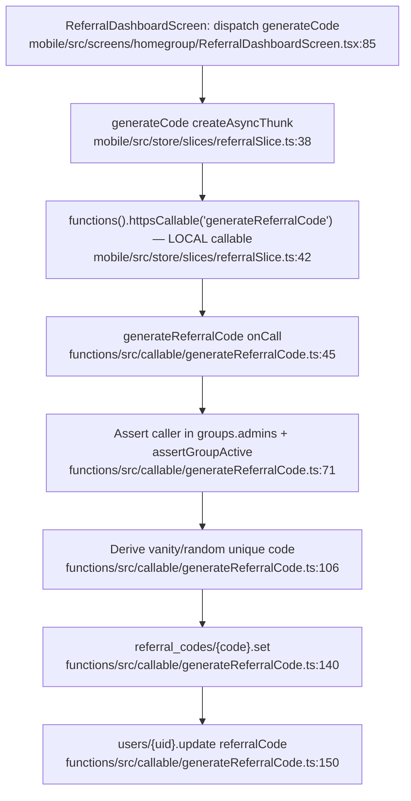

# Homegroups — FINANCE / ORG cluster flowcharts

Repo: `/Users/marcus/dev/recovery-platform/homegroups`. Each diagram traces the single most representative happy path. Every node label carries a verified `file:line`.

---

## Feature 1 — Stripe Subscriptions & Billing

Happy path: group admin starts a $12/yr group subscription via Stripe Checkout (in-app WebView → web page → `createStripeCheckoutSession` callable), pays in Stripe, then the `stripeWebhook` HTTP function receives `checkout.session.completed` and flips the `groups/{groupId}` document to `active`.

```mermaid
flowchart TD
    UI["SubscriptionUpgradeScreen: opens checkout modal<br/>mobile/src/screens/subscription/SubscriptionUpgradeScreen.tsx:97"]
    WV["SubscriptionWebView: WebView to web payment URL<br/>mobile/src/components/payments/SubscriptionWebView.tsx:282"]
    TOK["createWebAuthToken callable (WebView auth)<br/>mobile/src/components/payments/SubscriptionWebView.tsx:85"]
    CB["createStripeCheckoutSession onCall (v2)<br/>functions/src/callable/createStripeCheckoutSession.ts:25"]
    ADMIN["Assert caller in groups.admins/adminUids<br/>functions/src/callable/createStripeCheckoutSession.ts:59"]
    CUST["stripe.customers.create (if no stripeCustomerId)<br/>functions/src/callable/createStripeCheckoutSession.ts:69"]
    CUSTW["groups.update stripeCustomerId<br/>functions/src/callable/createStripeCheckoutSession.ts:75"]
    PRICE["getDefaultPriceForProduct(productIdGroup) + assertGroupPriceIsAnnual<br/>functions/src/callable/createStripeCheckoutSession.ts:86"]
    SESS["stripe.checkout.sessions.create (mode=subscription, metadata.groupId)<br/>functions/src/callable/createStripeCheckoutSession.ts:96"]
    PAY["User pays in Stripe Checkout (external)"]
    WH["stripeWebhook onRequest HTTP fn<br/>functions/src/http/stripeWebhook.ts:30"]
    SIG["stripe.webhooks.constructEvent (signature verify)<br/>functions/src/http/stripeWebhook.ts:89"]
    IDEM["Idempotency: processed_stripe_events.create(event.id)<br/>functions/src/http/stripeWebhook.ts:108"]
    DISP["processEvent switch on event.type<br/>functions/src/http/stripeWebhook.ts:164"]
    CASE["case checkout.session.completed → handler<br/>functions/src/http/stripeWebhook.ts:166"]
    H["handleCheckoutSessionCompleted<br/>functions/src/utils/stripeUtils.ts:53"]
    RETR["stripe.subscriptions.retrieve(subscriptionId)<br/>functions/src/utils/stripeUtils.ts:178"]
    UPD["groups.update: subscriptionStatus, stripeSubscriptionId, stripePriceIdGroup, expiresAt<br/>functions/src/utils/stripeUtils.ts:215"]
    REF["If groups.referralCode → processReferralConversion<br/>functions/src/utils/stripeUtils.ts:222"]
    DONE["res 200 {received:true}; mark processed_stripe_events status=processed<br/>functions/src/http/stripeWebhook.ts:129"]

    UI --> WV --> TOK --> CB
    CB --> ADMIN --> CUST --> CUSTW --> PRICE --> SESS --> PAY
    PAY --> WH --> SIG --> IDEM --> DISP --> CASE --> H
    H --> RETR --> UPD --> REF --> DONE
```

Notes:

- The mobile screen never calls Stripe directly; it loads a WebView (`SubscriptionWebView.tsx:282`) at a hosted web payment page after fetching a `createWebAuthToken`. The web page invokes the `createStripeCheckoutSession` callable. The callable is the verified server entry for the group flat-rate subscription.
- Webhook exports verified: `stripeWebhook` at `functions/src/http/stripeWebhook.ts:30`, `stripeConnectWebhook` at `:46` (both `functions.https.onRequest`).
- Signature verification is mandatory: failure returns `400 invalid signature` (`stripeWebhook.ts:89-95`).
- Idempotency is enforced atomically via `processed_stripe_events/{event.id}` create-fails-if-exists (`stripeWebhook.ts:106-124`).
- Subscription-state update is the `groups/{groupId}.update(...)` at `stripeUtils.ts:215`. Ongoing state changes route through `handleSubscriptionUpdated` (`stripeUtils.ts:408`, `groups.update` at `:429`) and `handleSubscriptionDeleted` (`stripeUtils.ts:486`).
- Scheduled/pubsub reconciliation backstops the webhook: `scheduledSubscriptionReconciler`, `scheduledRenewalReminders`, `scheduledTrialReminders` (`functions/src/triggers/pubsub/`).

External deps:

- Stripe API: `customers.create`, `prices.retrieve`, `checkout.sessions.create`, `subscriptions.retrieve`, `subscriptions.update`, `webhooks.constructEvent`.
- Firestore collections written: `groups`, `processed_stripe_events`.
- `react-native-webview` (mobile), Firebase callable transport.
- Env: `STRIPE_SECRET_KEY`, `STRIPE_WEBHOOK_SECRET`, `STRIPE_CONNECT_WEBHOOK_SECRET`, `STRIPE_PRODUCT_ID_GROUP`.

---

## Feature 2 — Treasury & Group Finance

Happy path: a treasurer records a transaction on `GroupTreasuryScreen` → `addTransaction` thunk → `TreasuryModel.createTransaction` writes a `transactions/{id}` doc → the `onTransactionWrite` Firestore trigger atomically increments the running balance in `treasury_overviews/{groupId}`.

Notes:

- Mobile writes only the `transactions` doc; the server-side trigger owns the authoritative balance (`onTransactionWrite.ts:217` increments `balance`). The screen reads denormalized stats via `fetchTreasuryStats` / `fetchGroupTransactions` (`GroupTreasuryScreen.tsx:219,223`).
- Trigger uses the same idempotency pattern as the Stripe webhook (`processed_transaction_events/{eventId}`, `onTransactionWrite.ts:86`) to avoid double-counting on retries.
- Other treasury callables (not on this primary path but in-feature): `generateTreasuryReport`, `initiateTreasurerHandoff`, `completeTreasurerHandoff` (`functions/src/callable/`); trigger `onGroupTreasurerUpdate` (`functions/src/triggers/firestore/`); slices `treasurySlice`, `recurringTransactionsSlice`, `treasurerHandoffSlice`.

External deps:

- Firebase Firestore (`transactions`, `treasury_overviews`, `processed_transaction_events`), Firebase Auth (`auth().currentUser`).
- `firebase-functions` v1 Firestore trigger API (`functionsV1.firestore.document(...).onWrite`).
- No Stripe and no recovery-api on this path.

---

## Feature 3 — Intergroup / Facility

Happy path: an admin creates an intergroup (tier A) → `createIntergroup` callable creates a Stripe customer + Checkout session, writes an `incomplete` `intergroups/{id}` doc → admin pays → `checkout.session.completed` webhook → `handleCheckoutSessionCompleted` activates the intergroup subscription.

Notes:

- `createIntergroup` writes the Firestore doc only after Stripe returns a session URL (`createIntergroup.ts:206-214`), leaving the doc `incomplete` until the webhook activates it.
- Webhook activation for intergroups is the dedicated branch inside `handleCheckoutSessionCompleted` keyed on `session.metadata.intergroupId` (`stripeUtils.ts:129-166`); ongoing updates via `handleIntergroupSubscriptionUpdated` (`stripeUtils.ts:239`) and deletes via `handleIntergroupSubscriptionDeleted` (`stripeUtils.ts:274`), both dispatched from the webhook at `stripeWebhook.ts:185` and `:192`.
- Tier A→B upgrade has its own branch (`stripeUtils.ts:59-126`) and the `upgradeIntergroupTier` callable.
- Facility read endpoints all gate on `intergroup.adminUids.includes(uid)`: `getFacilityStats` (`functions/src/callable/getFacilityStats.ts:34`), plus `exportFacilityComplianceReport`, `configureSSO`, `affiliateGroupToIntergroup`. Slice: `intergroupSlice`.

External deps:

- Stripe API: `customers.create`, `checkout.sessions.create`, `subscriptions.retrieve`, `subscriptions.cancel` (upgrade path).
- Firestore: `intergroups` (+ `members` subcollection), `processed_stripe_events`.
- Env: `STRIPE_PRODUCT_ID_INTERGROUP_A`, `STRIPE_PRODUCT_ID_INTERGROUP_B`; redirect allow-list `ALLOWED_REDIRECT_ORIGINS`.
- No recovery-api on this path.

---

## Feature 4 — Referrals (consumer of recovery-api?)

VERDICT: **LOCAL-ONLY.** The homegroups referral feature is implemented entirely against the product's own Firestore + Stripe. It does **not** call the shared recovery-api service. A repo grep over `functions/src` for `recovery-api`, `X-Service-Key`, `X-App-Id`, `createReferral`, `api/referrals`, `RECOVERY_API` returned **zero matches**. The mobile slice invokes only local Firebase callables (`functions().httpsCallable('getReferralStats' | 'generateReferralCode' | 'applyReferralCode')`, `mobile/src/store/slices/referralSlice.ts:27,42,61`). The `referrals` / `referral_codes` Firestore collections here are a homegroups-internal "refer a friend, extend your trial" mechanism — a different concept from the cross-app `recovery-api /api/referrals`.

Happy path shown: admin generates a referral code on the dashboard.

Secondary local paths (reward on conversion, no recovery-api):

- `applyReferralCode` writes `referrals/{id}` (status `pending`) and extends the referred group's Stripe trial to 90 days (`functions/src/callable/applyReferralCode.ts:89,129`).
- On the referred group's `checkout.session.completed`, `handleCheckoutSessionCompleted` calls `processReferralConversion` (`stripeUtils.ts:222`), which extends the referrer's Stripe subscription and marks the `referrals` doc `converted` (`stripeUtils.ts:712,765,788`).
- `getReferralStats` reads local `referrals` by `referrerId` (`functions/src/callable/getReferralStats.ts:34`).

External deps:

- Firebase callables + Firestore: `referral_codes`, `referrals`, `users`, `groups`.
- Stripe API: `subscriptions.update` (trial/period extension only) — local, not via recovery-api.
- **recovery-api: NOT used** (grep-confirmed zero references in `functions/src`).

---

## Cross-feature verdict & gaps

- Referrals: **LOCAL-ONLY**, evidence `mobile/src/store/slices/referralSlice.ts:27,42,61` (local callables) and zero `recovery-api`/`X-Service-Key`/`createReferral` references in `functions/src`.
- Stripe webhook exports verified by reading the file: `stripeWebhook` @ `stripeWebhook.ts:30`, `stripeConnectWebhook` @ `:46`.
- Gap: the mobile group-subscription happy path goes through a hosted-web WebView (`SubscriptionWebView.tsx:282`) + `createWebAuthToken`; the web page (not in this repo subtree traced) is what actually invokes `createStripeCheckoutSession`. The callable itself is verified server-side, but the exact web-side call site was not read.
- Note: `createGroupSubscription`, `createGroupWithSubscription`, `createCustomerPortalSession`, `reactivateGroupSubscription` exist as alternative billing callables but were not on the single representative happy path traced above.
