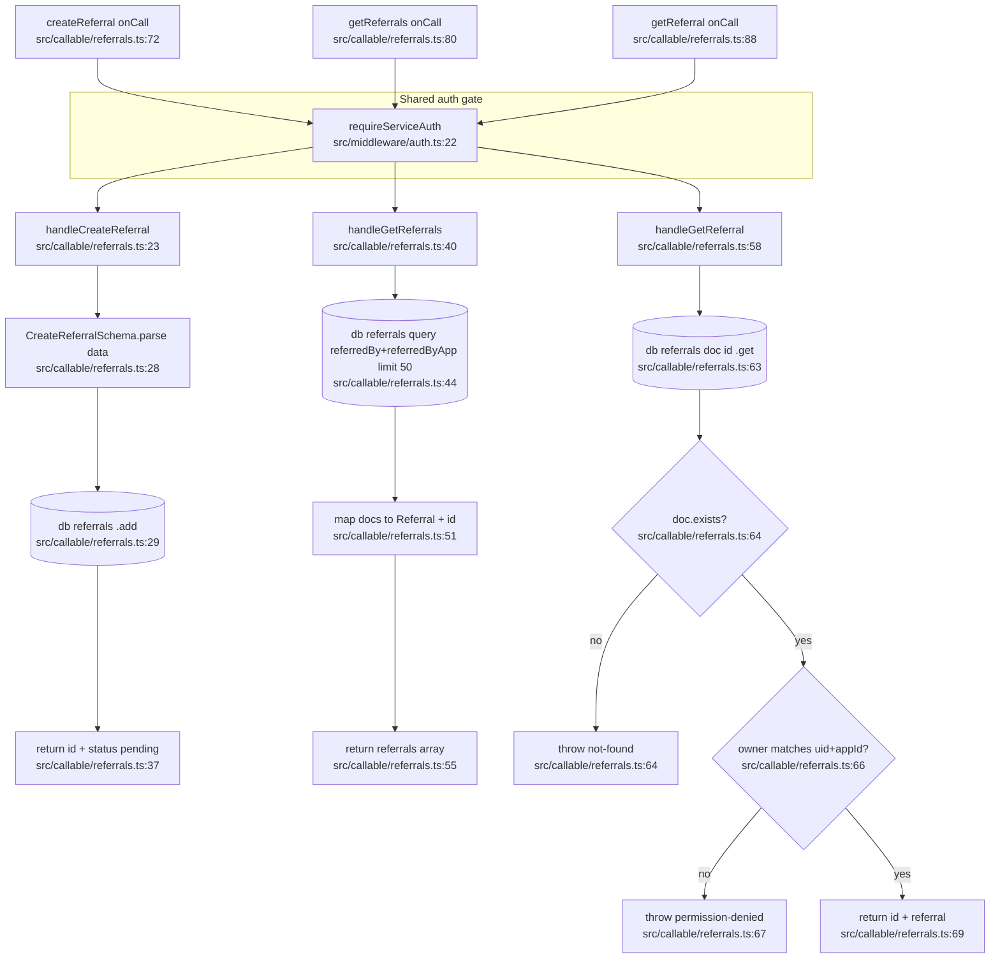
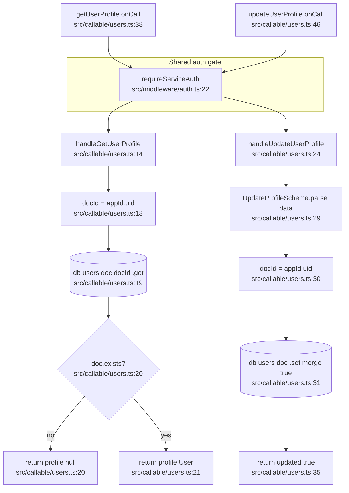
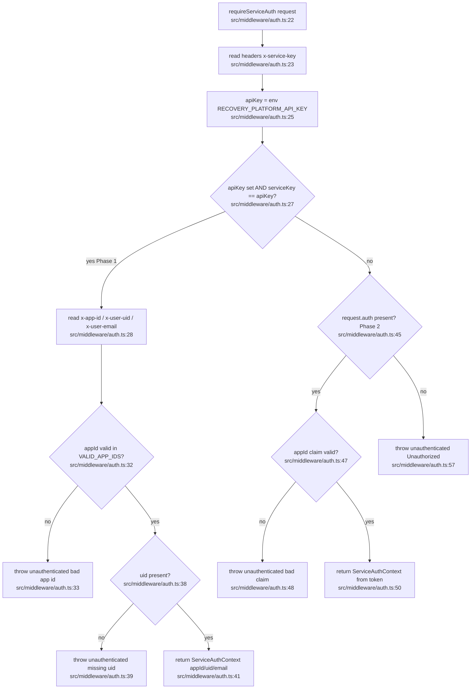
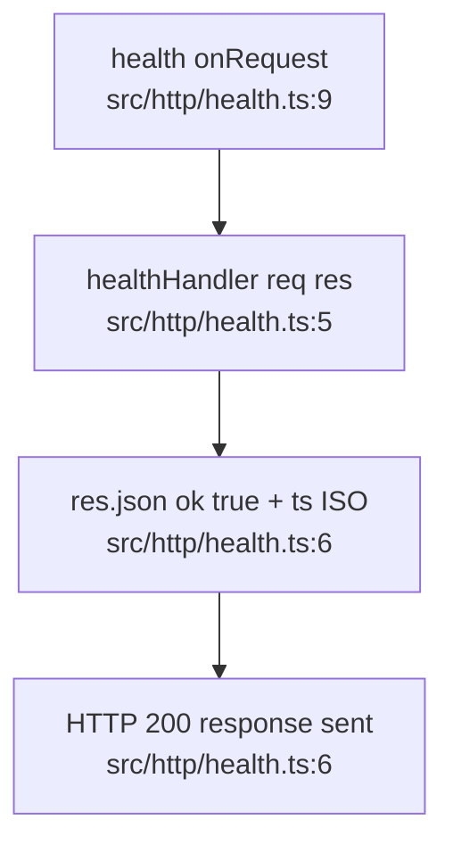

# recovery-api — Feature Flowcharts

Happy-path traces for each recovery-api feature. All callable functions share the
`requireServiceAuth` gate (`src/middleware/auth.ts:22`) as an upstream node before any
business logic runs. Firestore access goes through `getFirestore()` from
firebase-admin (collections noted per write/read).

---

## Cross-app Referral API

Three callable functions (`createReferral`, `getReferrals`, `getReferral`) all defined
in `src/callable/referrals.ts`. Each resolves auth via the shared middleware gate, then
delegates to a pure handler that reads/writes the `referrals` Firestore collection.

**External deps**

- Service Auth Middleware — `requireServiceAuth` (`src/middleware/auth.ts:22`)
- Firestore `referrals` collection (write on create, query on list, doc get on fetch)
- `getFirestore()` injected at call sites (`src/callable/referrals.ts:76,84,92`)
- Secret `RECOVERY_PLATFORM_API_KEY` (`src/config.ts:11`) bound to each onCall
- Zod `CreateReferralSchema` validation (`src/callable/referrals.ts:15`)

---

## User Profile API

Two callable functions (`getUserProfile`, `updateUserProfile`) in `src/callable/users.ts`.
Both build a composite doc id `{appId}:{uid}` and touch the `users` Firestore collection.

**External deps**

- Service Auth Middleware — `requireServiceAuth` (`src/middleware/auth.ts:22`)
- Firestore `users` collection (doc get on read, doc set/merge on update)
- `getFirestore()` injected at call sites (`src/callable/users.ts:42,50`)
- Secret `RECOVERY_PLATFORM_API_KEY` (`src/config.ts:11`) bound to each onCall
- Zod `UpdateProfileSchema` validation (`src/callable/users.ts:8`)
- `User` entity interface (`src/entities/User.ts:3`)

---

## Service Auth Middleware

`requireServiceAuth` is the shared gate invoked by every callable above. Happy path is
the Phase 1 service-key branch; Phase 2 (`request.auth` custom token) is the fallback.

**External deps**

- `process.env.RECOVERY_PLATFORM_API_KEY` — secret resolved at runtime (`src/middleware/auth.ts:25`); secret defined in `src/config.ts:11`
- `VALID_APP_IDS` allowlist set (`src/middleware/auth.ts:12`)
- `CallableRequest` / `HttpsError` from firebase-functions/v2/https (`src/middleware/auth.ts:1`)
- No Firestore or external HTTP — pure header/token validation
- Consumed by: Cross-app Referral API and User Profile API (all five callables)

---

## Health / Liveness

`health` is an `onRequest` HTTP function with no auth gate and no Firestore access — a
pure liveness probe returning a JSON timestamp.

**External deps**

- None — no auth, no Firestore, no external HTTP
- `Response` from express, `onRequest`/`Request` from firebase-functions/v2/https (`src/http/health.ts:1`)
