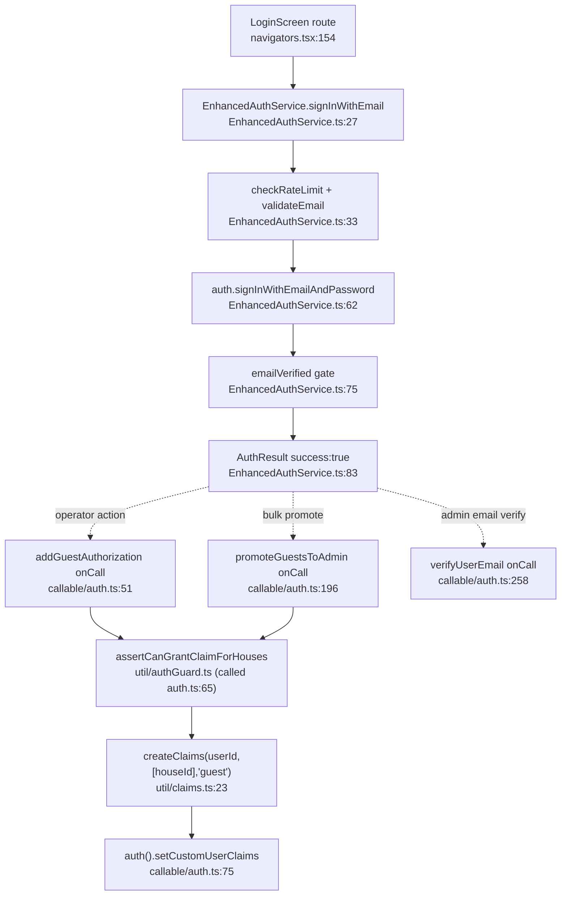
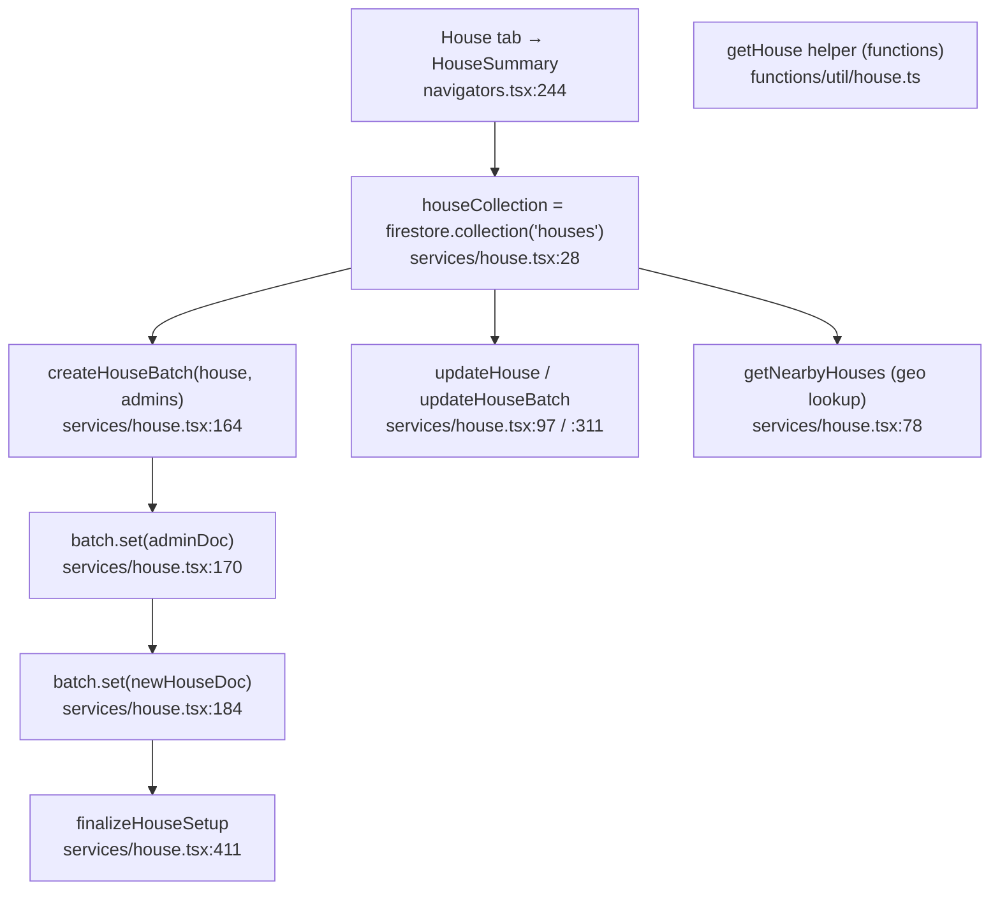
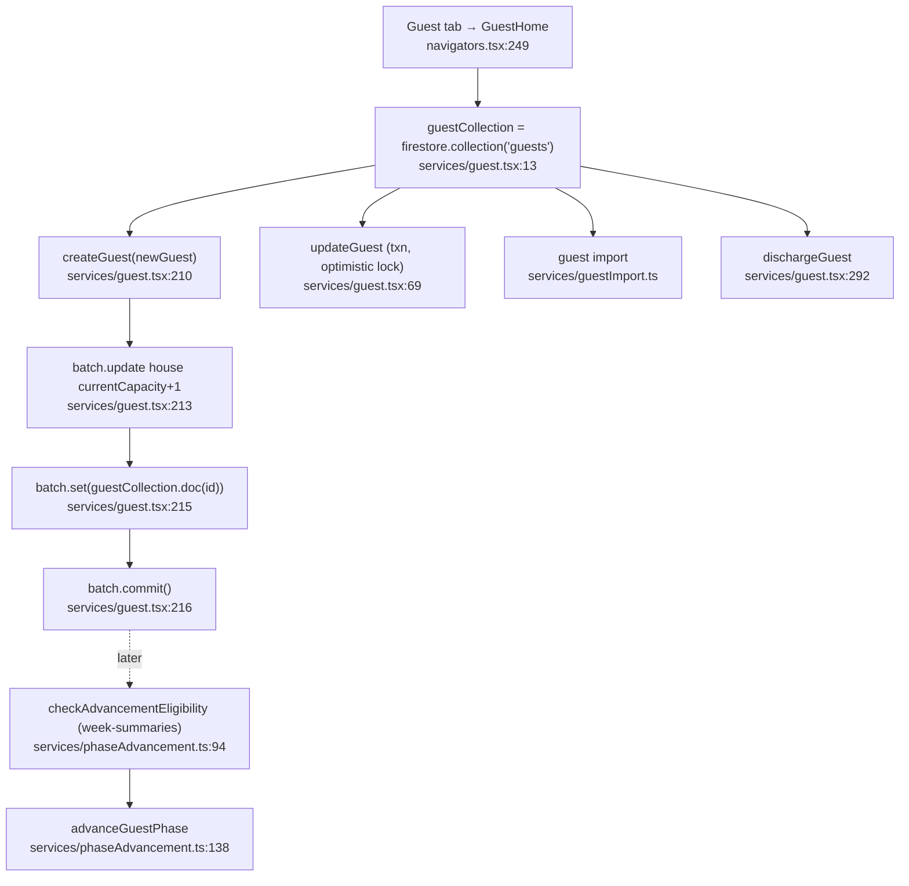
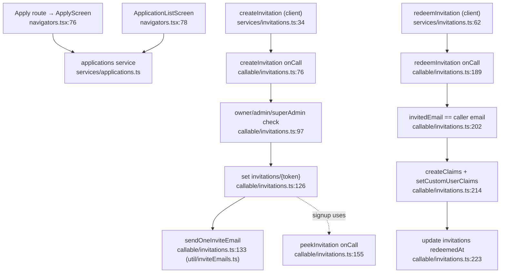
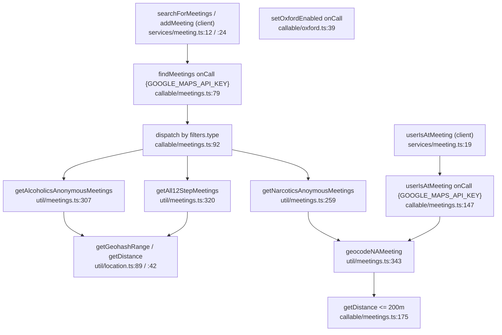
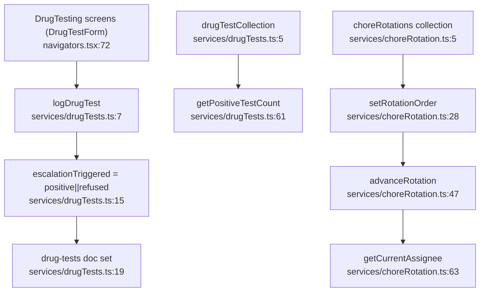
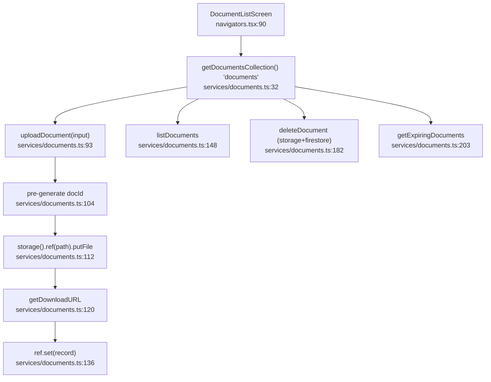

# regroup (Regroup) — Core Residents/House Flowcharts

Product: Regroup — RN 0.72 mobile + Firebase Functions v2 (`onCall`).
Firebase project: `phoenix-cleanhouse`. All callables verified as `firebase-functions/v2/https` `onCall`.

> **Platform gap (recovery-api referral integration):** regroup has **NO** integration with the shared
> recovery-api referral service. Grep for `recovery-api|createReferral|X-Service-Key|getReferrals` across
> `mobile/src` and `functions/src` produced only:
>
> - `functions/src/scripts/scriptBootstrap.ts:8` — `require("../../service-key.json")["phoenix-cleanhouse"]`
>   (a Firebase **Admin SDK** service-account credential for migration scripts, unrelated to recovery-api).
> - `functions/src/callable/homegroups.ts:10` — a hardcoded direct call to
>   `https://us-central1-recovery-connect-prod.cloudfunctions.net/getMeetingAttendance` (fetched at
>   `homegroups.ts:105`), i.e. a point-to-point bridge to the homegroups product, **bypassing** recovery-api.
>
> No `createReferral` / `getReferrals` call, no `X-Service-Key`/`X-App-Id`/`X-User-Uid` headers anywhere.
> regroup does not create or consume cross-app referrals. **Flagged gap confirmed.**

---

## Authentication & Account Setup

Happy path: resident/operator signs in → email-verified Firebase session → operator authorizes a guest →
custom claims set server-side (the only path that can write `guest`/`admin` claims).

Side effects:

- Custom-claims write: `setCustomUserClaims` for `guest` and (if `isAdmin`) `admin` claim per house (`callable/auth.ts:75`, `:83`).
- `promoteGuestsToAdmin` layers `admin` claims across distinct houseIds (`callable/auth.ts:196`–`225`).
- `verifyUserEmail` flips Firebase Auth `emailVerified` via `_verifyUserEmail` (`callable/auth.ts:258`, `util/user.ts`).
- No Firestore write in the auth callables themselves (claims live in the Auth token).

External deps: `@react-native-firebase/auth` (client `auth` singleton), `firebase-admin` `auth()`, `firebase-functions/v2/https`, Zod (`parseInput`).

---

## House & Bed Management

Happy path: operator creates a house (batched write of house + admin docs) → later guest creation
increments `currentCapacity`; bed assignment lives in the `House.rooms` map mutated on guest create/delete.

Side effects:

- Firestore batch write: `houses` doc + `admins` docs (`services/house.tsx:170`, `:184`).
- `updateHouseBatch` fans out updates to `houses`, `guests`, `admins`, `guest-archive` (`services/house.tsx:383`–`392`).
- Bed capacity counter updated on guest create (`services/guest.tsx:213`–`214`).
- Server-side `getHouse` is reused by callables (`functions/src/util/house.ts`, `functions/src/entities/House.ts`).

External deps: `@react-native-firebase/firestore` (client), `firebase-admin` firestore (server util), Redux selectors (HouseSummary).

---

## Guest / Resident Management

Happy path: operator creates a guest → batched write adds the `guests` doc and bumps house
`currentCapacity` (bed slot) → over time the guest advances phases via `week-summaries` eligibility check.

Side effects:

- Firestore batch: write `guests` doc + update `houses.currentCapacity` (`services/guest.tsx:213`–`216`).
- `updateGuest` runs a Firestore transaction with optimistic-lock guard (`OptimisticLockError`, `services/guest.tsx:69`, `:101`).
- `advanceGuestPhase` updates `guests/{id}.phase` (`services/phaseAdvancement.ts:142`); eligibility reads `week-summaries` (`:57`).
- `deleteGuest` writes `guest-archive` + frees room bed in `house.rooms` (`services/guest.tsx:220`–`253`).
- Server phase helpers in `functions/src/util/guest.ts`, `functions/src/util/phase.ts`.

External deps: `@react-native-firebase/firestore`, lodash `cloneDeep` (bed mutation), Redux.

---

## Applications & Invitations

Happy path (invitation, the privilege boundary): admin issues an invitation (Firestore doc + email) →
invitee signs up → client calls `redeemInvitation` → server verifies email match → sets custom claims →
marks invitation redeemed.

Side effects:

- Firestore write: `invitations/{token}` created (`callable/invitations.ts:126`), updated with `redeemedAt`/`redeemedByUid` on redeem (`:223`).
- Email send: `sendOneInviteEmail` (SendGrid via `functions/src/util/inviteEmails.ts`, `functions/src/util/invite.ts` for token/link).
- Custom-claims write: `guest` and/or `admin` claims for the house on redeem (`callable/invitations.ts:214`–`219`); `senior-peer` sets both.
- Token generation: `generateInvitationToken` / `buildInviteLink` (`util/invite.ts`).

External deps: `firebase-admin` firestore + auth, SendGrid (invite email), Zod, client `functions.httpsCallable`.

---

## Meetings (AA/NA attendance)

Happy path: client requests meetings near a location → `findMeetings` dispatches by type (AA/NA/Custom/CR)
→ external meeting sources filtered by geo distance → returns list. `userIsAtMeeting` geocodes + compares
distance for attendance verification.

Side effects:

- Geo queries: geohash range + haversine distance filtering (`util/location.ts:42`, `:89`–`104`, uses `ngeohash`).
- External HTTP: Google Maps Geocoding API (`GOOGLE_MAPS_API_KEY` secret; `geocodeNAMeeting` `util/meetings.ts:343`) and external AA/NA/CR meeting feeds.
- No Firestore write in `findMeetings`/`userIsAtMeeting`; client `addMeeting` writes `meetings` collection (`services/meeting.ts:24`, collection `:10`).
- `userIsAtMeeting` returns boolean (200m threshold) used by attendance verification, no write here.

External deps: Google Maps Geocoding, `ngeohash`, `firebase-functions/v2/https` secrets, AA/NA/Celebrate-Recovery external sources.

---

## Chore / Work / Drug-Test Tracking

Happy path: operator logs a drug test for a guest → result auto-flags escalation (positive/refused) →
Firestore `drug-tests` doc written. Chore rotation order is set per house and advanced over time.

Side effects:

- Firestore write: `drug-tests/{id}` with computed `escalationTriggered` flag (`services/drugTests.ts:19`).
- Firestore write: `choreRotations/{houseId}` set on order assignment (`services/choreRotation.ts:40`) and update on advance (`:53`).
- Reads: positive-test aggregation (`services/drugTests.ts:61`), per-guest/per-house queries (`:27`, `:44`).
- Entities: `entities/Chore.tsx`, `entities/DrugTest.ts`, `entities/Job.ts`.

External deps: `@react-native-firebase/firestore`, `logException` util.

---

## Documents

Happy path: user picks a file → `uploadDocument` uploads binary to Cloud Storage → fetches download URL →
writes metadata doc to `documents` collection.

Side effects:

- Cloud Storage upload: `putFile` to `houses/{houseId}/{docId}` path (`services/documents.ts:112`–`117`; path via `buildStoragePath`).
- Firestore write: `documents/{docId}` metadata incl. `storageUrl`, `uploadedBy`, `createdAt` (`services/documents.ts:136`).
- `deleteDocument` deletes both Storage object and Firestore doc (`services/documents.ts:191`).
- Generic storage helpers (avatars/photos) in `services/storage.tsx` (`uploadPhoto:42`, `uploadHousePhoto:90`).

External deps: `@react-native-firebase/storage`, `@react-native-firebase/firestore`, `logException`.

---

## Summary

- 7 features traced; all node labels carry verified `file:line` anchors.
- All listed callables confirmed as v2 `onCall` exports (auth.ts:51/94/196/258, invitations.ts:76/155/189, meetings.ts:79/147, oxford.ts:39).
- **recovery-api referral integration: ABSENT.** Only a same-product hardcoded Homegroups HTTP bridge
  (`homegroups.ts:10/105`) and an Admin-SDK service-account file (`scriptBootstrap.ts:8`) exist. No
  `createReferral`/`getReferrals`/`X-Service-Key` usage. Flagged platform gap confirmed.
