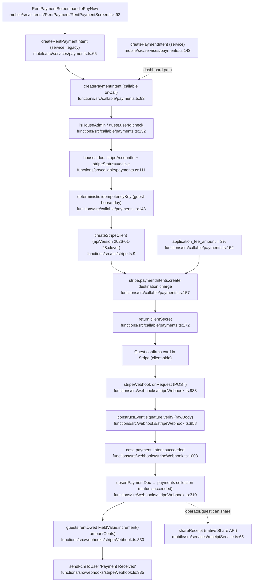
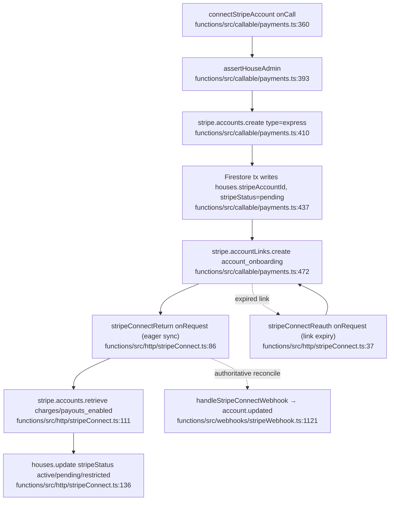
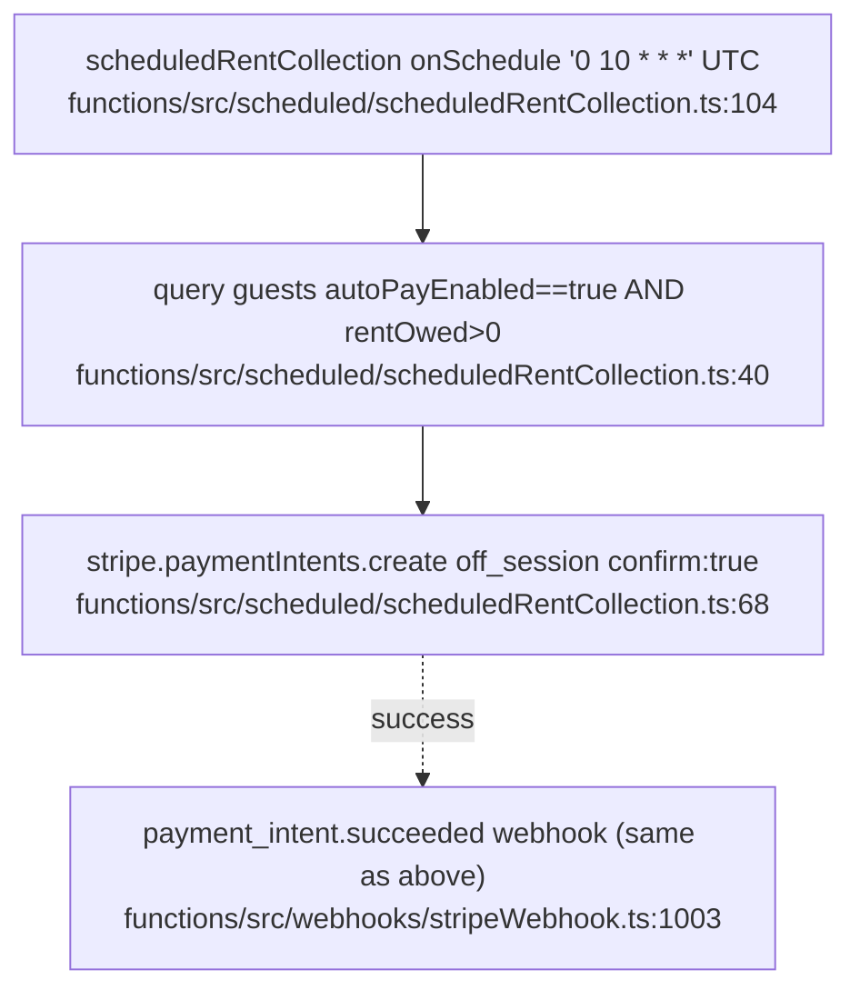
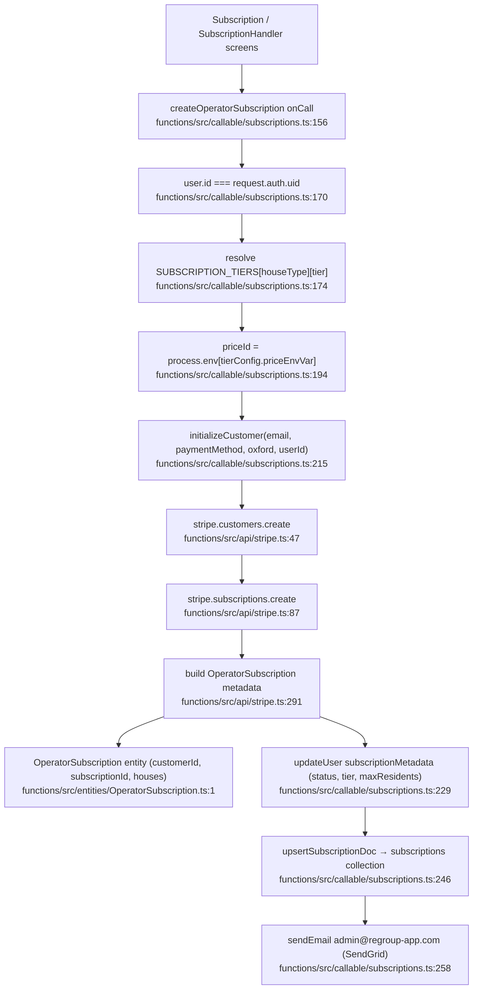
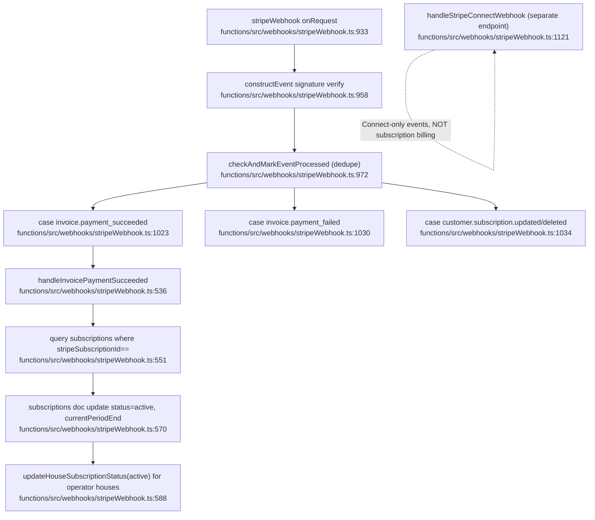
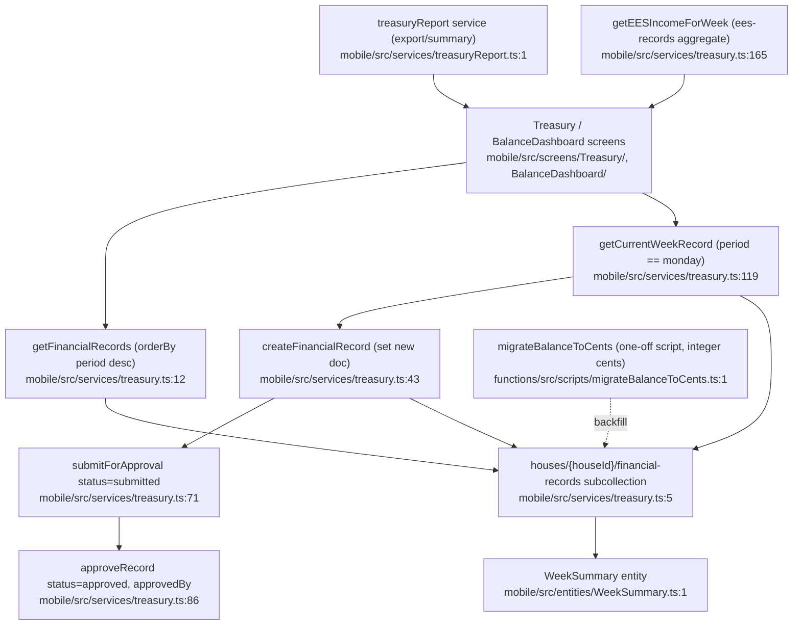
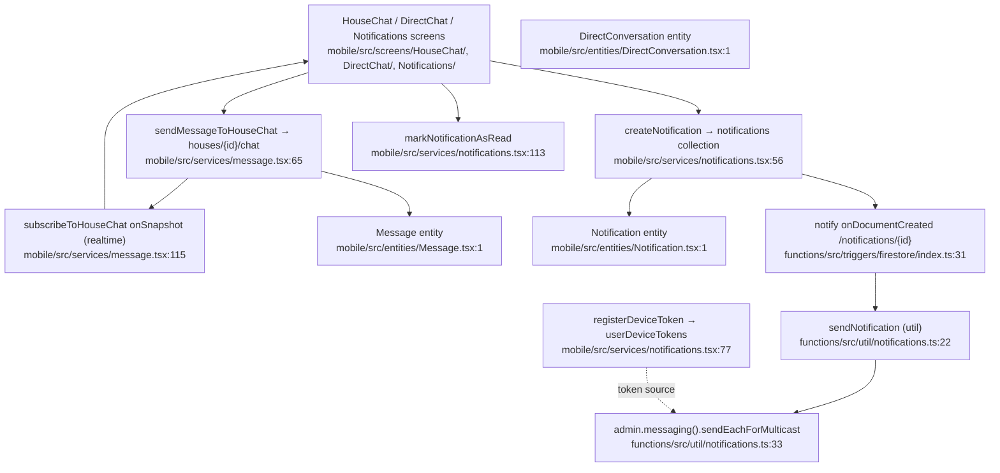
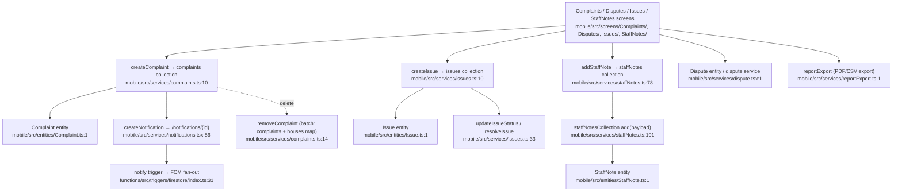
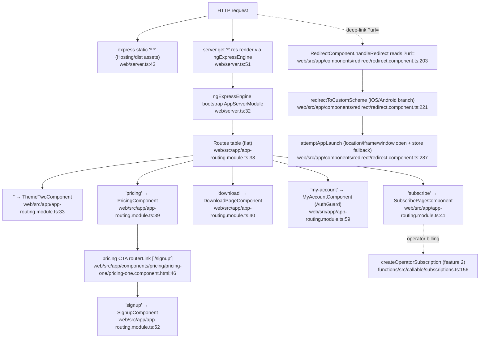

# Regroup — FINANCE / OPS / WEB Cluster Flowcharts

Pathfinder run 2026-06-06. Primary happy-path traces for the six finance/ops/web features.
Every node is labelled `Name relative/path:line` with a verified line. All paths are under
`/Users/marcus/dev/recovery-platform/regroup`.

Stripe amount convention (project-wide): **US cents, integers**. `50000` = $500.00. Dollars↔cents
conversion happens only at the UI boundary.

---

## 1. Payments & Rent (Stripe Connect)

Happy path: resident taps "Pay Now" → `createPaymentIntent` callable builds a **destination charge**
on the house's connected account (2% application fee) → returns `clientSecret` → guest confirms in
Stripe → `payment_intent.succeeded` webhook decrements `rentOwed` and FCM-notifies the guest →
receipt shareable via native share sheet.

**Stripe Connect onboarding (operator side, prerequisite):**

**Scheduled auto-pay (no UI):**

**External dependencies:** Stripe API (`paymentIntents`, `accounts`, `accountLinks`, `accounts.retrieve`),
**Stripe Connect** (Express accounts, destination charges with `transfer_data.destination` +
`application_fee_amount`), Firebase Auth (`request.auth`), Firestore (`houses`, `guests`, `payments`),
FCM push (`sendFcmToUser`), React Native `Share` API for receipts. Secret: `STRIPE_SECRET_KEY` via
Secret Manager. Webhook signature secret: `STRIPE_WEBHOOK_SECRET`.

**homegroups parallel:** regroup's Stripe client factory lives at `functions/src/util/stripe.ts:9`
(`createStripeClient`) — structurally mirrors homegroups' `utils/stripe.ts`. Both pin the same
`2026-01-28.clover` API version and centralise `mapStripeError`. regroup additionally implements the
**Connect destination-charge / application-fee** rent model (resident→house connected account), which
is regroup-specific vs homegroups' primary subscription billing.

---

## 2. Operator Subscriptions / Billing

Happy path: operator submits payment method + tier → `createOperatorSubscription` resolves the tier's
Stripe price → `initializeCustomer` creates a Stripe customer + subscription → writes
`subscriptionMetadata` onto the user and seeds the `subscriptions` collection → renewal invoices flow
back through `stripeWebhook` (`invoice.payment_succeeded`) to keep the `subscriptions` doc + house
statuses in sync.

**Renewal / state reconcile via webhook:**

**External dependencies:** Stripe API (`customers`, `subscriptions`, `invoices` via webhook),
Firestore (`users`, `subscriptions`, `houses`), SendGrid email (`sendEmail`), price IDs from env vars
keyed by tier config. Secrets: `STRIPE_SECRET_KEY`, `STRIPE_WEBHOOK_SECRET`, `SENDGRID_API_KEY`.

**Verified webhook export lines:** `stripeWebhook` at **functions/src/webhooks/stripeWebhook.ts:933**,
`handleStripeConnectWebhook` at **functions/src/webhooks/stripeWebhook.ts:1121**. Both verify the
Stripe signature against `req.rawBody` (`constructEvent`) before processing — `stripeWebhook` uses
`STRIPE_WEBHOOK_SECRET`, `handleStripeConnectWebhook` uses `STRIPE_CONNECT_WEBHOOK_SECRET`
(stripeWebhook.ts:1143). The two webhooks are split: standard account billing/subscription events go
to `stripeWebhook`; Connect platform events (`account.updated`, `account.application.deauthorized`)
go to `handleStripeConnectWebhook` (stripeWebhook.ts:1160, :1164).

**homegroups parallel:** regroup's subscription customer/subscription creation lives in
`functions/src/api/stripe.ts` (`createCustomer:47`, `subscriptions.create:87`, `initializeCustomer:306`)

- the `OperatorSubscription` entity — this mirrors homegroups' subscription module structure. Both
  seed a Firestore `subscriptions`/subscription doc so webhook handlers can resolve by
  `stripeSubscriptionId`. The mobile service `mobile/src/services/subscription.ts:10` is a thin
  `httpsCallable` wrapper (matches homegroups' callable-wrapper convention); `paywall.ts:3` is just a
  Firestore config ref.

---

## 3. Treasury (house finances)

Happy path: operator/staff opens Treasury/BalanceDashboard → reads the per-house
`financial-records` subcollection (week summaries) → creates/edits the current week record → submits
for approval → another admin approves. All amounts persisted as integer cents (post
`migrateBalanceToCents`). Pure Firestore CRUD, no Stripe.

**External dependencies:** Firestore only (`houses/{id}/financial-records`, `ees-records`). No Stripe,
no FCM, no email on the core path. `migrateBalanceToCents.ts` is a deploy-time script, not a function.
Amounts are integer cents (enforced by the migration). `treasuryReport.ts` builds export/summary text.

**homegroups parallel:** none structural — treasury is regroup-specific (sober-living house ledger).

---

## 4. Messaging & Notifications

Happy path: user sends a house-chat message → written to `houses/{id}/chat` subcollection → a
real-time `onSnapshot` listener delivers it to other members. Out-of-band notifications use the
notification-fan-out pattern: write a `/notifications/{id}` doc → the `notify` Firestore trigger sends
the FCM push to the recipient's registered device token.

**External dependencies:** Firestore (`houses/{id}/chat`, `direct-messages`/`chat`, `notifications`,
`userDeviceTokens`), Firebase Cloud Messaging (`admin.messaging().sendEachForMulticast`). The chat
itself is pure Firestore realtime; push is decoupled via the `/notifications/{id}` write → `notify`
trigger fan-out. No Stripe, no email on this path.

**homegroups parallel:** none structural for chat. The `/notifications/{id}` → trigger → FCM fan-out
is a generic pattern but uses regroup's own `util/notifications.ts`.

---

## 5. Complaints / Disputes / Issues / Staff Notes

Happy path (complaint as representative): staff files a complaint → `createComplaint` writes to the
top-level `complaints` collection (and the house doc keeps a `complaints` map) → to notify staff, a
`/notifications/{id}` doc is written which triggers the `notify` FCM fan-out (shared with feature 4).
Issues, Disputes, and StaffNotes follow the same Firestore-write shape.

**External dependencies:** Firestore (`complaints`, `issues`, `staffNotes`, `disputes`, plus the
`houses` doc complaints/issues maps), the shared `/notifications/{id}` → `notify` → FCM fan-out for
staff push, `reportExport.ts` for export artifacts. No Stripe. `requireUser()` enforces an
authenticated author on staff notes (staffNotes.ts:87).

**homegroups parallel:** none structural — this is regroup-specific sober-living operations.

---

## 6. Web Marketing / Pricing Portal (Angular)

Mapped at module/route level (Angular 9 SSR). Happy path: visitor hits any route → Firebase Hosting
serves static assets, dynamic routes render through the `universal` SSR Cloud Function (`server.ts`
Express engine) → marketing/pricing pages route via the flat `app-routing.module.ts` → pricing CTA
links to `/signup` (operator subscription is completed via the shared callables in feature 2). Mobile
deep-link handoff is handled client-side by `RedirectComponent`, which reads `?url=` and attempts
custom-scheme → universal-link → app-store fallback.

**External dependencies:** Angular Universal SSR via `@nguniversal/express-engine`
(`ngExpressEngine`, server.ts:32), Firebase Hosting (static) + the `universal` SSR Cloud Function
(see web/CLAUDE.md), Firebase Auth (`AuthGuard` on `/my-account`), the shared `phoenix-cleanhouse`
callables for billing (`CloudFunctionService` wraps `createOperatorSubscription`, `getPaymentMethod`,
`updatePaymentInfo`, `cancelUserSubscription`, `reactivateOperatorSubscription`,
`createBillingPortalSession`). `RedirectComponent` is browser-only (guarded by
`isPlatformBrowser`, redirect.component.ts:155) and not wired into `app-routing.module.ts`.

**homegroups parallel:** the web portal's billing CTAs ultimately call the same Connect-account /
operator-subscription Stripe stack as feature 2 (`functions/src/api/stripe.ts`), which structurally
parallels homegroups' subscription module.

---

## Gaps & Notes

- **Web `redirect` not routed:** `RedirectComponent` exists (`redirect.component.ts`) but no `redirect`
  path appears in `app-routing.module.ts` — deep-link handling appears to be reached by direct
  bootstrap / a non-Angular host rather than the flat route table. Flagged, not blocking.
- **`accounts/` components** (`login`, `signup`, `reset`, `my-account`) are referenced by routes
  (lines 51, 52, 53, 59) but the directory under `components/accounts/` is the implementation home;
  the route table imports them under aliases — verified at route level only as instructed.
- **Mobile Stripe confirmation step** (card entry / `clientSecret` confirm) happens client-side after
  `createPaymentIntent` returns; `RentPaymentScreen.handlePayNow:122` branches on a legacy
  `result.paymentUrl` (WebView path) that the current callable no longer returns (payments.ts:172
  returns only `clientSecret`) — see deprecated field note at payments.ts service:29. Confirmed
  structural mismatch, surfaced as a gap for the inventory subagent.
