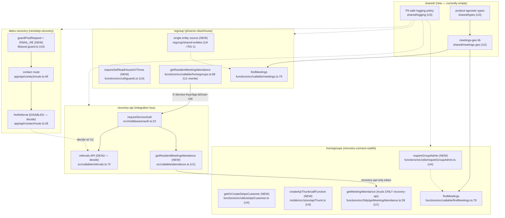

# Pathfinder — Unified Architecture Proposal

**Date:** 2026-06-06
**Author:** orchestrator (synthesis — not delegated)
**Inputs:** `00-features.md`, `01-flowcharts/*`, `02-duplication-report.md`

This proposes the **simplest** unified design for each concern that is NOT legitimate specialization. Where the Phase 2 verdict was LOW/LEGIT (Stripe stacks D4, auth runtimes D5, Firebase init D6, cross-product FCM D7, the referral _name collision_ D1), **no unification is proposed** — merging them would add coupling for no benefit, or is impossible (three Firebase Auth instances cannot share runtime claims).

**Anti-patterns explicitly rejected in this proposal:** no new abstraction layers "for flexibility"; no feature flags keeping both old paths alive; no registry/factory where a switch or a direct call suffices; no preserving divergent behavior "just in case." Each proposal deletes a path or a fork, it does not add an indirection.

---

## U1 — Route the cross-product attendance read through recovery-api (fixes C1)

**Problem.** regroup → homegroups is a direct, hardcoded Cloud Function call (`regroup/functions/src/callable/homegroups.ts:105` → `homegroups/functions/src/http/getMeetingAttendance.ts:39`) guarded by one shared static secret (`RATS_API_KEY`) living in both projects. homegroups does no authorization of its own. This is the platform's only real cross-product flow and it does it the explicitly-forbidden way.

**Unified design (one broker, one credential boundary).** recovery-api becomes the broker it was designed to be:

```
regroup callable  ──X-Service-Key+X-App-Id+X-User-Uid──▶  recovery-api callable
   (homegroups.ts)                                          getResidentMeetingAttendance
                                                                    │
                                                     internal service token (held ONLY by recovery-api)
                                                                    ▼
                                              homegroups getMeetingAttendance (trusts ONLY recovery-api)
```

- **Single new entry point:** `recovery-api/src/callable/attendance.ts` → `getResidentMeetingAttendance` (mirrors the existing `referrals.ts`/`users.ts` callable shape, gated by `requireServiceAuth` at `recovery-api/src/middleware/auth.ts:22`). recovery-api holds the one credential to homegroups; regroup never holds a homegroups secret.
- **homegroups side:** `getMeetingAttendance.ts:44-53` stops trusting a secret shared with regroup; it trusts **only** recovery-api's service token (single consumer, single rotation point). Optionally keep the existing HMAC compare but with a recovery-api-only key.
- **What each old call site becomes:**
  - `regroup/functions/src/callable/homegroups.ts:8-10` — delete the hardcoded `recovery-connect-prod` URL + `RATS_API_KEY`. `:105` `fetch(RC_URL, …)` becomes a recovery-api client call (`POST`/callable with `X-Service-Key`, `X-App-Id: phoenix-cleanhouse`, `X-User-Uid`). regroup's own resident/house-admin check (`homegroups.ts:80`) stays — it gates _who in regroup_ may ask.
  - `homegroups/functions/src/http/getMeetingAttendance.ts` — narrows its allowed caller to recovery-api; adds the authz it currently skips (recovery-api passes the asserting `X-User-Uid`; homegroups can verify the user is a member of `groupId`).
- **Loss of capability:** one extra hop (regroup→recovery-api→homegroups) adds latency. **Acceptable** — this is exactly the integration-bus design the platform committed to, and it removes a static cross-project secret and an unauthorized read path.
- **Also:** correct `regroup/functions/CLAUDE.md` which falsely claims the bridge already routes via recovery-api.

> Aligns with the existing `new-referral-flow` skill's intent — same `X-Service-Key`/`X-App-Id`/`X-User-Uid` envelope, applied to attendance.

---

## U2 — Extract a shared `meetings-geo` library (fixes D2 + part of D8)

**Problem.** `homegroups/functions/src/utils/{location,meetings}.ts` and `regroup/functions/src/util/{location,meetings,geohash}.ts` are a drifting verbatim fork (same haversine, same magic constants, same `getNarcoticsAnoymousMeetings` misspelling). Inputs are public AA/NA feeds + Google Maps — zero PII, zero cross-project data.

**Unified design (one library, two importers, forks deleted).**

- **Consolidated component:** `shared/meetings-geo/` (plain TS, no Firebase dependency) exporting: `getDistance`, `getGeohashRange`/`getQueriesForDocumentsAround`, `locationIsInArea`, `getAddressFromGeocode`, the `MeetingTypeFilters` union, the AA/NA/Oxford/Celebrate feed adapters, and the `Meeting` + `GeocodeResponse` types.
- **Single entry point per concern:** `import { findMeetingsNear, MeetingTypeFilters, Meeting } from "@recovery/meetings-geo"`.
- **What each old call site becomes:**
  - homegroups `findMeetings.ts:7-12` and regroup `meetings.ts:7-14` import from the shared package; the per-product `utils/location.ts`, `util/location.ts`, `util/meetings.ts`, `util/geohash.ts` forks are **deleted** (superset reconciled into the package — keep regroup's GeoFire bbox + Celebrate adapter as package functions).
  - Google Maps key stays a per-product secret passed _into_ the library (library is credential-free).
- **Loss of capability:** none. The superset is preserved; only the duplication is removed.

---

## U3 — Seed `shared/` with product-agnostic types + a PII-safe logging policy (fixes D8 remainder + D3)

**Problem.** `shared/` is empty (0 files) despite being reserved for exactly this. Product-agnostic types are forked (`Meeting`, `GeocodeResponse`, lat/lng), and the platform-mandated PII-safe logging rule has no shared implementation — each product reimplements it and regroup already drifted into logging device tokens (`regroup/functions/src/util/notifications.ts:62-66`).

**Unified design (a tiny dependency-free package, not a framework).**

- **`shared/types/`** — the genuinely product-agnostic types only: `Meeting`, `GeocodeResponse`, `LatLng`, `MeetingTypeFilters` (re-exported by U2's package). **NOT** `User`/`Referral` — those mean different things per product and stay local (legit specialization).
- **`shared/logging/`** — a policy module, not a logger binding: `sanitizeError(err): string` (maps internals → safe message) + `assertNoPII(fields)` / a loggable-field allow-list. Each runtime (Functions v2, Functions v1, Next.js) imports the policy and feeds its own logger.
- **What each old call site becomes:** regroup `notifications.ts:62-66` stops logging tokens and routes through `sanitizeError`; recovery-api/homegroups/detox adopt `sanitizeError` at their API error boundaries (replacing hand-rolled fixed strings).
- **Loss of capability:** none. **Rejected alternative:** a shared logger _instance_ — four runtimes differ, so a binding would force a lowest-common-denominator dependency. Policy-only keeps it portable.

---

## U4 — Per-product intra-product helper consolidations (fixes RG-1, HG-1/2/3/4, RG-2/3, DX-1)

These are **not** cross-product — each is a single-product helper that deletes copy-paste. They are unified _within_ their product and handed off as separate plans (Phase 4). Summary of the single entry point each introduces:

| Product    | Helper (single entry point)                                         | Replaces                                    | Evidence                                                                     |
| ---------- | ------------------------------------------------------------------- | ------------------------------------------- | ---------------------------------------------------------------------------- |
| regroup    | one entity source of truth (`regroup/shared-entities` or `shared/`) | functions/ + mobile/ entity twins           | `entities/User.ts:14` vs `User.tsx:74` (drift)                               |
| homegroups | `requireGroupAdmin(request, groupId)`                               | 19 callables' auth+load+admin preamble      | `createStripeCheckoutSession.ts:34-64`, `createGroupSubscription.ts:66-97`   |
| homegroups | `getOrCreateStripeCustomer(ref, data, email)`                       | 3+ get-or-create blocks                     | `createStripeCheckoutSession.ts:66-78`, `createStripePaymentIntent.ts:61-71` |
| homegroups | `createApiThunk()` / `callFunction()`                               | ~200 thunk try/catch + httpsCallable bodies | `treasurySlice.ts:46-130`, `adminRemovalSlice.ts:64-157`                     |
| regroup    | `requireSelf(request, uid)` / `loadHouseOrThrow(id)`                | 12+ self-id + 6 house-load preambles        | `subscriptions.ts:159-171`, `payments.ts:111-114`                            |
| detox      | `guardPostRequest(req, bucket)` + exported `EMAIL_RE`               | duplicated 25-line POST preamble            | `contact/route.ts:49-83`, `subscribe/route.ts:29-64`                         |

**Anti-pattern guard for U4:** these are thin extract-method helpers. Do NOT turn them into a "framework" — `requireGroupAdmin` returns `{groupRef, groupData}` and throws; it does not become a decorator system. The HG-1 helper must also **fix** the admin-field divergence (standardize on `admins || adminUids`), not preserve both readings.

---

## Decision required (not a unification): D1 — recovery-api referral API is dead in production

recovery-api's `createReferral`/`getReferrals`/`getReferral` (`referrals.ts:72,80,88`) have **zero live callers**: homegroups "referrals" are a local refer-a-friend mechanic (different concept), detox's cross-app firing is disabled (`contact/route.ts:36`), regroup has none. This is not duplication to unify — it is a **build-or-delete decision**:

- **Wire it up** — enable detox's `fireReferral` (uncomment `SHARED_API_URL`/`INTERNAL_API_KEY` in `apphosting.yaml`) and add a regroup referral client, making recovery-api a live bus; **or**
- **Delete** the referral API until a real consumer exists, to stop shipping unused, security-surface-bearing endpoints.

Recommend deciding this alongside U1 (both are "make recovery-api a real bus" questions).

---

## Combined proposed unified system



**Legend:** solid = runtime call; dashed = "consumed by / policy applied to". `(NEW)` = component to create; `DEAD`/`DISABLED` = exists but no live path (D1 decision).
