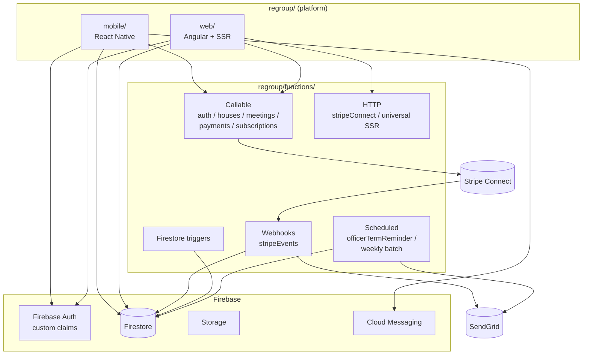
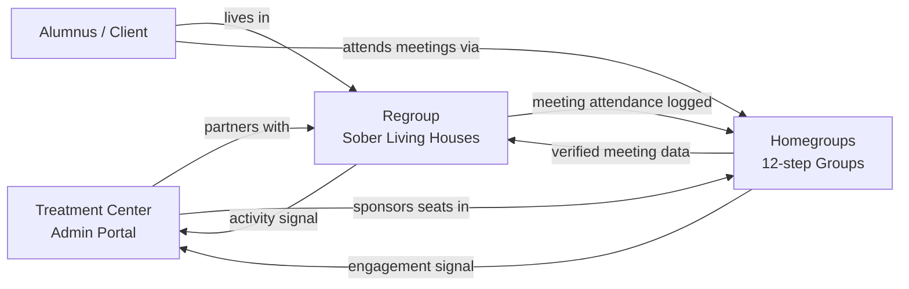

# Recovery Platform — Product Map

> Source of truth for all products in the recovery ecosystem.

<!-- Merged from: 01-rats-sober-living.md, 02-recoveryconnect-homegroups.md, 03-integration-treatment-centers.md -->

## Regroup — Sober Living Operations Platform

> **Platform:** `regroup/` — sub-components: `mobile/` (iOS + Android), `web/` (marketing + web portal), `functions/` (backend)
> **Audience:** Sober living house operators, house managers, residents, and Oxford House chapters.

---

### 1. What Regroup Is

Regroup (Recovery Activity Tracking System) is a full-stack platform for running sober living homes. It replaces the patchwork of paper binders, group chats, spreadsheets, and Venmo requests that most houses rely on today with a single system of record for residents, compliance, rent, and house governance.

The platform supports two operating models in one codebase:

1. **Manager-operated houses** — a staff owner/manager enforces rules, collects rent, resolves disputes, and signs off on compliance.
2. **Oxford Houses** — democratically self-governed homes with elected officers, weekly business meetings, Equal Expense Share (EES) accounting, and formal voting.

Feature gating by subscription tier (`oxfordEnabled`, admin claims) lets a single deployment serve both audiences.

---

### 2. Value Proposition

| Stakeholder                            | Problem today                                                                                       | What Regroup delivers                                                                                                                |
| -------------------------------------- | --------------------------------------------------------------------------------------------------- | --------------------------------------------------------------------------------------------------------------------------------- |
| **House operator / owner**             | Rent collection, compliance paperwork, and incident logs are scattered; liability is hard to prove. | Stripe-powered rent, auditable activity logs, dispute and complaint records, drug-test history — all attributable and exportable. |
| **House manager**                      | Tracking who did chores, attended meetings, worked, or took medication is manual.                   | Unified Activities module with one tap per event; automatic summaries per resident.                                               |
| **Resident**                           | Proving program compliance (meetings, work, supporters, chores) is tedious and adversarial.         | Self-service activity logging on mobile; transparent history they own.                                                            |
| **Oxford House chapter**               | Officer rotation, business meetings, and EES math are done on paper and prone to error.             | Officer roles with term reminders, business-meeting minutes, vote tallying, and automated EES calculations.                       |
| **Treatment center / referral source** | No visibility into whether placed clients are actually engaging.                                    | Admin/super-admin role with cross-house reporting (sets up the integration story in doc 03).                                      |

---

### 3. Feature Set

#### 3.1 Core house operations

- **Bed & room management** — house layout, bed assignments, move-in/move-out.
- **Guest (resident) profiles** — personal info, phase, supporters, emergency contacts.
- **Phase advancement** — structured program phases with activity thresholds.
- **Disputes, complaints, issues** — logged, attributable, resolvable.
- **Chores** — assignable, trackable, rotatable.

#### 3.2 Activities (unified tracking)

Single model covers meetings, chores, work, medication, and supporter visits. Replaces the legacy "Week/Day" model. Produces per-resident activity summaries used for phase progression and compliance reporting.

#### 3.3 Rent & payments

- Stripe Connect Express with destination charges — money moves from resident → platform → house's connected account.
- Payment history, balance dashboard, idempotent payment intents (deduped per guest per UTC day).
- Webhook-driven Firestore payment records and SendGrid receipts.

#### 3.4 Drug testing

Test recording, result history, and attribution per resident.

#### 3.5 Oxford House governance (gated)

- Elected officer positions with term tracking and expiration reminders.
- Business meetings with minutes and attendance.
- Voting (motion creation, secret/open ballots, atomic tally via Firestore transactions).
- Equal Expense Share (EES) tracker and transfers.

#### 3.6 Communication

- Direct messaging between residents, managers, and admins.
- House-wide chat.
- Push notifications (FCM + Notifee) for messages, officer reminders, payment events.

#### 3.7 Security & access

- Firebase Auth with custom claims: `guest`, `admin`, `superAdmin`, `potentialSuperAdmin`.
- Two-factor setup flow.
- Sentry error reporting via a centralized `logException()` wrapper.

#### 3.8 Billing (web portal)

- Marketing site with six theme variants.
- Account creation, login, password reset.
- Stripe subscription management and billing portal.

---

### 4. Technical Overview

#### 4.1 Components

| Component          | Path               | Role                                         | Stack                                                                         |
| ------------------ | ------------------ | -------------------------------------------- | ----------------------------------------------------------------------------- |
| Regroup mobile     | `regroup/mobile/`  | iOS + Android app for managers and residents | React Native 0.72, TypeScript, Redux Toolkit, React Query, React Navigation 6 |
| Regroup web        | `regroup/web/`     | Public marketing site + web portal           | Angular 9, Angular Universal SSR, Firebase Hosting, ngx-stripe                |
| Regroup functions  | `regroup/functions/` | Shared backend                             | Node 22, Firebase Functions 7, Admin SDK 13, Stripe 20, SendGrid              |

#### 4.2 System diagram

#### 4.3 Mobile app (`regroup/mobile/`) architecture

- **Provider tree:** `ErrorBoundary → SafeAreaProvider → StripeProvider → ThemeProvider → DataProvider → NotificationProvider → ModalProvider → Auth → RootNavigator`.
- **State:** Redux Toolkit for UI/client state (13 slices); React Query for server state (11 query files).
- **Navigation:** Route names centralized in `src/navigation/types.ts` as a `Routes` enum. Three layers: RootStack (auth/setup/main), AuthStack, MainTabParamList.
- **Service layer:** `src/services/` wraps Firestore reads/writes and Cloud Function calls (`httpsCallable`).
- **Offline resilience:** `offlineQueue.enqueue()` with up to 3 retries on network failure.

#### 4.4 Web app (`regroup/web/`) architecture

- Flat Angular routing with six theme variants for landing pages.
- `AuthGuard` protects account and billing routes.
- Two deployed functions: `universal` (SSR HTTP handler) and `warmWebsite` (per-minute Pub/Sub warmer to avoid cold starts).
- Build requires `NODE_OPTIONS=--openssl-legacy-provider` (Angular 9 + newer Node).

#### 4.5 Backend (`regroup/functions/`) surface

| Type               | Examples                                                                                    | Notes                                            |
| ------------------ | ------------------------------------------------------------------------------------------- | ------------------------------------------------ |
| Callable           | `createPaymentIntent`, house CRUD, meeting creation, subscription linking, EES calculations | Invoked via `httpsCallable()` from mobile/web    |
| HTTP               | `stripeConnect` OAuth callback, `universal` SSR proxy                                       |                                                  |
| Webhook            | `stripeEvents` (charge succeeded/failed/refunded)                                           | Updates payment records, sends SendGrid receipts |
| Firestore triggers | Guest stats recalculation, meeting record updates                                           |                                                  |
| Scheduled          | `officerTermReminder`, weekly payment/compliance batches                                    | Pub/Sub cron                                     |

Idempotency keys for payment intents are deterministic (`guestId + utcDay`) unless an explicit key is passed. All Stripe errors are mapped to Firebase `HttpsError` with caller-friendly messages.

#### 4.6 Data model highlights

- Firestore is the primary store; Realtime Database is legacy and being phased out.
- Role-based access enforced in security rules using custom claims set from Firestore `admin`/`superAdmin` membership.
- Entity interfaces live in `regroup/mobile/src/entities/` and `regroup/web/src/app/entities/` — kept loosely in sync by convention (a shared-types package is a known future consolidation).

---

### 5. Entry Points (for developers)

| Concern         | File                                                           |
| --------------- | -------------------------------------------------------------- |
| Mobile app root | `regroup/mobile/App.tsx`                                       |
| Mobile routes   | `regroup/mobile/src/navigation/types.ts`                       |
| Mobile Redux    | `regroup/mobile/src/state/store.ts`                            |
| Web root module | `regroup/web/src/app/app.module.ts`                            |
| Web routes      | `regroup/web/src/app/app-routing.module.ts`                    |
| Functions root  | `regroup/functions/src/index.ts`                               |
| Stripe webhook  | `regroup/functions/src/webhooks/stripeWebhook.ts`              |
| Payment intent  | `regroup/functions/src/callable/payments.ts`                   |

---

### 6. Commercial Positioning

Regroup is sold to the house operator, not the resident. Pricing tiers gate:

- Base tier: bed management, activity tracking, communication, Stripe rent.
- Oxford tier: officer/voting/EES modules.
- Enterprise/multi-house tier (prerequisite for the treatment-center integration story): super-admin dashboard across many houses, exportable compliance reports.

The platform's durable competitive moat is the **activity + payment ledger** — once a house runs rent and compliance through Regroup for a few months, the switching cost is very high.

---

## Homegroups — Homegroups Platform

> **Marketed as:** Homegroups
> **Repo:** `Homegroups` (contains `mobile/`, `functions/`, `web/`)
> **Audience:** 12-step recovery group members, secretaries, treasurers, and intergroup / service committees.

---

### 1. What Homegroups Is

Homegroups is a privacy-first mobile and web platform for running 12-step recovery groups (AA, NA, and similar fellowships). It does for the **group** what Regroup does for the **sober living house**: it replaces paper ledgers, GroupMe chats, and seventh-tradition envelopes with a single, anonymity-preserving system of record.

The product is built around the principle of **group autonomy + member anonymity**:

- No real names required — first name + last initial is the default display.
- Each group controls its own data, treasury, positions, and moderation.
- Identity is scoped to groups; there is no global social graph.

---

### 2. Value Proposition

| Stakeholder                   | Problem today                                                                          | What Homegroups delivers                                                                                                                          |
| ----------------------------- | -------------------------------------------------------------------------------------- | ------------------------------------------------------------------------------------------------------------------------------------------------- |
| **Member**                    | Meeting times change, chat apps leak identity, announcements get lost.                 | Accurate meeting info, in-group chat with @mentions, push notifications for celebrations and announcements — all under an anonymous display name. |
| **Group secretary / admin**   | Rotation of service positions is chaotic; announcements scatter across SMS and email.  | Position tracking with term dates, one-tap pinned announcements, invite-code onboarding.                                                          |
| **Treasurer**                 | Physical cashbox and a spreadsheet passed on USB sticks between treasurers every year. | Categorized income/expenses, balance + prudent reserve, recurring transactions, and a formal handoff workflow.                                    |
| **Sponsor / sponsee**         | Step work tracking relies on paper and memory.                                         | Sponsor links across groups, step-work companion, scoped direct messaging.                                                                        |
| **Intergroup / service body** | Reporting across dozens of groups requires manual polling.                             | Intergroup module (V4.4) with cross-group announcements, data export, and facility-level stats.                                                   |
| **Treatment center**          | No structured way to connect clients to real outside groups.                           | Verified groups + invite flow + engagement signals (sets up the integration story in doc 03).                                                     |

---

### 3. Feature Set

The MVP is feature-complete with a roadmap to V4.4. 13 domain modules are implemented:

1. **Authentication** — Email/password, Google, Apple, Facebook SSO.
2. **Profile & privacy** — Display name, sobriety date, per-group privacy toggles for sobriety date and phone.
3. **Meetings** — Geolocated finder with filters (format, program, day, time), map/directions, online links.
4. **Groups** — Discovery, create/join/leave, member directory, admin edits.
5. **Service positions** — Define roles (Secretary, Treasurer, GSR, etc.), assign with term dates, rotation tracking.
6. **Treasury** — Income/expenses with categories, balance, prudent reserve, monthly totals, treasurer handoff, recurring transactions.
7. **Announcements** — Admin-only authoring, pinning, FCM push delivery.
8. **Group chat & DMs** — Real-time messaging, @mentions, reactions, replies, attachments, admin deletion.
9. **Sobriety tracking** — Live counter, milestone medallions (24 hr → multi-year), celebration animations, group announcements on milestones.
10. **Governance** — Conscience votes, elections (nominate → vote → close), business-meeting minutes with approval, moderation/reporting.
11. **Sponsorship** — Cross-group sponsor/sponsee links, step-work companion, scoped DMs.
12. **Literature & resources** — Daily reflections, bookmarks, meeting topics, contributed literature.
13. **Advanced** — Deep-link invite codes, Stripe subscriptions ($12/year admin tier), intergroup (V4.4), white-label branding (V4.4), referral program, group-health dashboard.

> **V4.1–V4.4 Mobile UI Status:** The Cloud Functions backend and Firestore schema for V4.1 (Governance), V4.2 (Content), V4.3 (Analytics), and V4.4 (Enterprise/Intergroup) are implemented. However, all mobile UI entry points for these features are hidden behind boolean feature flags in `mobile/src/config/featureFlags.ts` — every flag is currently `false`. End users on the current release cannot access any V4.x feature. To enable a feature, set its flag to `true` in `featureFlags.ts` and ship a new build. The intergroup navigator stack (`AppNavigator.tsx:153`) is additionally gated by `SHOW_V4_ENTERPRISE_INTERGROUP`.

---

### 4. Technical Overview

#### 4.1 Components

| Component    | Stack                                                                                     | Purpose                                                                                |
| ------------ | ----------------------------------------------------------------------------------------- | -------------------------------------------------------------------------------------- |
| `mobile/`    | React Native, TypeScript, Redux Toolkit (26 slice files, 24 registered), React Navigation | Primary user experience (iOS + Android)                                                |
| `functions/` | Node 22, TypeScript, Firebase Admin, Stripe SDK, SendGrid, geofire-common                 | Backend: 90 callables + 16 Firestore triggers + 14 scheduled jobs + webhooks           |
| `web/`       | React                                                                                     | Marketing site + deep-link landings + `apple-app-site-association` for Universal Links |

#### 4.2 Entry Points (for developers)

| Concern           | File                                                                                                                                                  |
| ----------------- | ----------------------------------------------------------------------------------------------------------------------------------------------------- |
| Mobile root       | `mobile/App.tsx`                                                                                                                                      |
| Navigation        | `mobile/src/navigation/` (AppNavigator → MainTabNavigator)                                                                                            |
| Redux slices      | `mobile/src/store/slices/` (26 slice files, 24 registered in the store)                                                                               |
| Screens           | `mobile/src/screens/{auth,homegroup,meetings,profile,messages,announcements,service,moderation,admin,sponsorship,onboarding,subscription,intergroup}` |
| Functions root    | `functions/src/index.ts`                                                                                                                              |
| Stripe utils      | `functions/src/utils/stripe.ts`, `stripeUtils.ts`                                                                                                     |
| Firestore rules   | `firestore.rules`                                                                                                                                     |
| Deep-link landing | `web/` + `apple-app-site-association` on Firebase Hosting                                                                                             |

---

### 5. Commercial Positioning

Homegroups is a **prosumer** product: free for individuals, $12/yr per group admin, with enterprise tiers for intergroups and treatment centers. The moat is the combination of privacy-preserving identity, accurate meeting data, and the treasury/governance ledger — once a group's treasurer has twelve months of categorized history in the app, a new treasurer has every reason to stay on it.

---

## Regroup + Homegroups — Integrated Offering for Treatment Centers

> **Companion docs:** Regroup section above · Homegroups section above
> **Audience:** Treatment-center directors of operations, clinical directors, alumni/aftercare coordinators, and the sales team pitching them.

---

### 1. Why a Treatment Center Should Care

The single biggest driver of long-term outcomes after inpatient or residential treatment is **continuity of care**: does the client land in a safe house, and do they actually attend outside 12-step meetings? Treatment centers today have near-zero visibility into either.

Two best-of-breed products already solve the two halves of this problem:

- **Regroup** is the system of record for the **sober living house** — where the client sleeps, pays rent, does chores, takes drug tests, and logs activity.
- **Homegroups** is the system of record for the **12-step group** — where the client actually works a program, has a sponsor, and builds a sober network.

Sold together, they close the loop that matters most to a treatment center: _Is our alumnus showing up — at home and at meetings — 30, 60, 180 days after discharge?_

---

### 2. The Integrated Offering

#### 2.1 The three surfaces the center buys

1. **Sober Living network visibility (Regroup super-admin tier).** Cross-house dashboard for partner sober-living homes. Alumni are placed into a house with one click, and every rent payment, drug test, phase advancement, dispute, and activity entry is visible to the center.

2. **Alumni homegroup engagement (Homegroups facility tier, V4.4).** Clients keep using Homegroups after discharge. The center is set up as a _facility_ and sees aggregated, privacy-preserving engagement: meetings checked into, milestones hit, sponsorship links formed — never chat content.

3. **A single "continuing care" view.** A thin integration layer stitches the two together so a case manager sees one timeline per alumnus.

---

### 3. How the Two Stacks Connect

Both products are built on Firebase (Auth + Firestore + Functions + FCM + Stripe), which makes integration a matter of identity, shared references, and a modest bridge layer rather than a re-platforming.

#### 3.1 Identity bridge

- Use a single Firebase Auth tenant (or federated auth with a shared `externalUserId` claim).
- Add a `linkedIdentities` doc keyed by user with `{ ratsGuestId, homegroupsUserId, treatmentCenterAlumnusId }`.
- Custom claims extended to include `facilityId` so Firestore rules on both sides honor facility-level read scopes.

#### 3.2 Meeting / attendance bridge

Regroup already has a `meetings` concept inside the Activities module. Homegroups owns accurate, geolocated, verified meeting data and a real `checkInToMeeting` callable.

- Point Regroup's meeting finder at the Homegroups `findMeetings` callable → residents search from one canonical directory.
- When a resident checks in on Homegroups, a trigger writes a Regroup `Activity` record of type `meeting` referencing the Homegroups `meetingInstance` ID.

#### 3.3 Facility dashboard bridge

| Signal                   | Source                                            |
| ------------------------ | ------------------------------------------------- |
| Rent paid / outstanding  | Regroup `stripeEvents` webhook + payment records     |
| Drug test results        | Regroup Drug Testing module                          |
| Phase / activity summary | Regroup Activities + guest summary                   |
| Meeting attendance       | Homegroups `recordCheckIn` / `checkInToMeeting`   |
| Sobriety milestones      | Homegroups `recordMilestone` + `onMilestoneWrite` |
| Sponsorship formed       | Homegroups `sponsorshipSlice` state + triggers    |

---

### 4. Implementation Roadmap

| Phase                               | Scope                                                                                                      | Effort                       |
| ----------------------------------- | ---------------------------------------------------------------------------------------------------------- | ---------------------------- |
| **0 — Pre-sales demo**              | Mocked combined dashboard using real Regroup + Homegroups data from a pilot house/group pair                  | 2 weeks                      |
| **1 — Identity + meeting bridge**   | Shared Auth tenant, `linkedIdentities`, Homegroups `findMeetings` wired into Regroup, check-in mirror trigger | 4–6 weeks                    |
| **2 — Facility dashboard**          | Per-alumnus timeline function, facility web view                                                           | 6–8 weeks                    |
| **3 — Enterprise polish**           | SSO (`configureSSO`), BAA-grade logging, exportable PDF outcome reports, billing consolidation             | 8–10 weeks                   |
| **4 — V4.4 intergroup/facility GA** | Ships Homegroups facility features already on the roadmap; treatment-center tier becomes a productized SKU | Aligned with Homegroups V4.4 |
