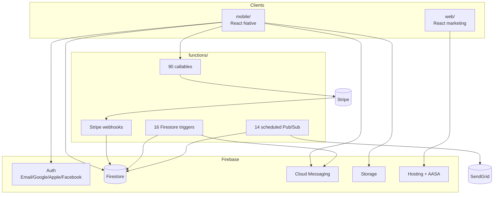

> ⚠️ **Legacy document.** Carried over from the standalone `RecoveryConnect` repository, archived on 2026-06-06. Historical reference only — may be outdated and is NOT part of current `homegroups` documentation.

# RecoveryConnect — Homegroups Platform

> **Marketed as:** Homegroups
> **Repo:** `RecoveryConnect` (contains `mobile/`, `functions/`, `web/`)
> **Audience:** 12-step recovery group members, secretaries, treasurers, and intergroup / service committees.

---

## 1. What Homegroups Is

Homegroups is a privacy-first mobile and web platform for running 12-step recovery groups (AA, NA, and similar fellowships). It does for the **group** what RATS does for the **sober living house**: it replaces paper ledgers, GroupMe chats, and seventh-tradition envelopes with a single, anonymity-preserving system of record.

The product is built around the principle of **group autonomy + member anonymity**:

- No real names required — first name + last initial is the default display.
- Each group controls its own data, treasury, positions, and moderation.
- Identity is scoped to groups; there is no global social graph.

---

## 2. Value Proposition

| Stakeholder                   | Problem today                                                                          | What Homegroups delivers                                                                                                                          |
| ----------------------------- | -------------------------------------------------------------------------------------- | ------------------------------------------------------------------------------------------------------------------------------------------------- |
| **Member**                    | Meeting times change, chat apps leak identity, announcements get lost.                 | Accurate meeting info, in-group chat with @mentions, push notifications for celebrations and announcements — all under an anonymous display name. |
| **Group secretary / admin**   | Rotation of service positions is chaotic; announcements scatter across SMS and email.  | Position tracking with term dates, one-tap pinned announcements, invite-code onboarding.                                                          |
| **Treasurer**                 | Physical cashbox and a spreadsheet passed on USB sticks between treasurers every year. | Categorized income/expenses, balance + prudent reserve, recurring transactions, and a formal handoff workflow.                                    |
| **Sponsor / sponsee**         | Step work tracking relies on paper and memory.                                         | Sponsor links across groups, step-work companion, scoped direct messaging.                                                                        |
| **Intergroup / service body** | Reporting across dozens of groups requires manual polling.                             | Intergroup module (V4.4) with cross-group announcements, data export, and facility-level stats.                                                   |
| **Treatment center**          | No structured way to connect clients to real outside groups.                           | Verified groups + invite flow + engagement signals (sets up the integration story in doc 03).                                                     |

---

## 3. Feature Set

The MVP is feature-complete with a roadmap to V4.4. 13 domain modules are implemented:

1. **Authentication** — Email/password, Google, Apple, Facebook SSO.
2. **Profile & privacy** — Display name, sobriety date, per-group privacy toggles for sobriety date and phone.
3. **Meetings** — Geolocated finder with filters (format, program, day, time), map/directions, online links.
4. **Groups** — Discovery, create/join/leave, member directory, admin edits.
5. **Service positions** — Define roles (Secretary, Treasurer, GSR, etc.), assign with term dates, rotation tracking.
6. **Treasury** — Income/expenses with categories, balance, prudent reserve, monthly totals, treasurer handoff, recurring transactions.
7. **Announcements** — Admin-only authoring, pinning, FCM push delivery.
8. **Group chat & DMs** — Real-time messaging, @mentions, reactions, replies, attachments, admin deletion.
9. **Sobriety tracking** — Live counter, milestone medallions (24 hr → multi-year), celebration animations, group announcements on milestones.
10. **Governance** — Conscience votes, elections (nominate → vote → close), business-meeting minutes with approval, moderation/reporting.
11. **Sponsorship** — Cross-group sponsor/sponsee links, step-work companion, scoped DMs.
12. **Literature & resources** — Daily reflections, bookmarks, meeting topics, contributed literature.
13. **Advanced** — Deep-link invite codes, Stripe subscriptions ($12/year admin tier), intergroup (V4.4), white-label branding (V4.4), referral program, group-health dashboard.

> **V4.1–V4.4 Mobile UI Status:** The Cloud Functions backend and Firestore schema for V4.1 (Governance), V4.2 (Content), V4.3 (Analytics), and V4.4 (Enterprise/Intergroup) are implemented. However, all mobile UI entry points for these features are hidden behind boolean feature flags in `mobile/src/config/featureFlags.ts` — every flag is currently `false`. End users on the current release cannot access any V4.x feature. To enable a feature, set its flag to `true` in `featureFlags.ts` and ship a new build. The intergroup navigator stack (`AppNavigator.tsx:153`) is additionally gated by `SHOW_V4_ENTERPRISE_INTERGROUP`.

---

## 4. Technical Overview

### 4.1 Components

| Component    | Stack                                                                                     | Purpose                                                                                |
| ------------ | ----------------------------------------------------------------------------------------- | -------------------------------------------------------------------------------------- |
| `mobile/`    | React Native, TypeScript, Redux Toolkit (26 slice files, 24 registered), React Navigation | Primary user experience (iOS + Android)                                                |
| `functions/` | Node 22, TypeScript, Firebase Admin, Stripe SDK, SendGrid, geofire-common                 | Backend: 90 callables + 16 Firestore triggers + 14 scheduled jobs + webhooks           |
| `web/`       | React                                                                                     | Marketing site + deep-link landings + `apple-app-site-association` for Universal Links |

### 4.2 System diagram

### 4.3 Backend surface

**Callables (selection of 83):**

- _Discovery:_ `findMeetings`, `searchGroupsByLocation`
- _Lifecycle:_ `createGroupWithSubscription`, `generateGroupInvite`, `joinGroupByInviteCode`, `sendGroupInviteEmail`
- _Identity:_ `setUserAsSuperAdmin`, `syncUserClaims`, `createWebAuthToken`
- _Payments:_ `createStripeCheckoutSession`, `createStripePaymentIntent`, `createGroupSubscription`, `createCustomerPortalSession`, `reactivateGroupSubscription`
- _Governance:_ `createConscienceVote` / `castConscienceVote` / `closeConscienceVote`; `openElection` / `nominateForElection` / `castElectionVote` / `closeElection`; `saveMeetingMinutes` / `approveMeetingMinutes`
- _Content:_ `seedDailyReflections`, `postGroupDailyThought`, `contributeLiterature`, `bookmarkLiteratureForGroup`
- _Moderation:_ `banUser`, `initiateAdminRemoval`, `voteOnAdminRemoval`
- _Engagement:_ `recordCheckIn`, `checkInToMeeting`, `recordMilestone`, `getMilestones`, `generateIntergroupReport`, `getGroupDashboardMetrics`
- _Enterprise (V4.4):_ `createIntergroup`, `affiliateGroupToIntergroup`, `configureSSO`, `exportGroupData`, `exportIntergroupData`

**Triggers:** `onUserCreated`, `onGroupCreate`, `onMeetingCreate` / `Delete`, `onAnnouncementCreate`, `onDirectMessageCreate`, `onMemberWrite` (claims sync with 1000-byte fallback), `onTransactionWrite` (treasury aggregation), `onMilestoneWrite`, `onReportCreate`, and more.

**Scheduled:** daily meeting instances, meeting reminders, position reminders, trial reminders, milestone reminders, recurring transactions, admin-removal expiry, daily reflections, group backups.

### 4.4 Firestore data model (key collections)

| Collection                            | Purpose                                                                                       |
| ------------------------------------- | --------------------------------------------------------------------------------------------- |
| `users`                               | Profile, sobriety date, FCM tokens, privacy settings, `homeGroups[]`                          |
| `groups`                              | Metadata, `admins[]`, `members[]`, Stripe product/price IDs, subscription status, `isClaimed` |
| `members` (`{groupId}_{userId}`)      | Per-group role flags (`isAdmin`, `isTreasurer`), privacy, join date                           |
| `meetings`                            | Recurring meeting templates                                                                   |
| `meetingInstances`                    | Materialized occurrences (generated daily by scheduled function)                              |
| `announcements`                       | Group announcements with pin flag                                                             |
| `group_chats/{groupId}/messages`      | Chat subcollection                                                                            |
| `transactions` + `treasury_overviews` | Ledger + aggregated balance                                                                   |
| `groupInvites`                        | Invite codes (deep-link targets)                                                              |
| `servicePositions`                    | Role definitions with terms                                                                   |
| `consciences`, `elections`            | Governance artifacts                                                                          |
| `milestones`                          | Sobriety milestone records                                                                    |
| `reports`                             | Moderation queue                                                                              |
| `intergroups` (V4.4)                  | Multi-group coordination                                                                      |

### 4.5 Security model

- Claims-based Firestore rules: `superAdmin`, `memberGroups`, `adminGroups`, `treasurerGroups`.
- Claims are synced by `onMemberWrite`. When the 1000-byte custom-claim budget overflows, rules fall back to reading the `members/` doc.
- Members read; admins write settings; treasurers write transactions.

### 4.6 Monetization

- Members free.
- Group-admin subscription at **$12 / year** via Stripe Checkout; unlocks treasury, position tracking, invite/removal, scheduling admin.
- Stripe customer portal for self-serve management.
- Webhook-driven subscription state machine.
- V4.4 adds intergroup / facility tiers (the entry point for the treatment-center story).

---

## 5. Entry Points (for developers)

| Concern           | File                                                                                                                                                  |
| ----------------- | ----------------------------------------------------------------------------------------------------------------------------------------------------- |
| Mobile root       | `mobile/App.tsx`                                                                                                                                      |
| Navigation        | `mobile/src/navigation/` (AppNavigator → MainTabNavigator)                                                                                            |
| Redux slices      | `mobile/src/store/slices/` (26 slice files, 24 registered in the store)                                                                               |
| Screens           | `mobile/src/screens/{auth,homegroup,meetings,profile,messages,announcements,service,moderation,admin,sponsorship,onboarding,subscription,intergroup}` |
| Functions root    | `functions/src/index.ts`                                                                                                                              |
| Stripe utils      | `functions/src/utils/stripe.ts`, `stripeUtils.ts`                                                                                                     |
| Firestore rules   | `firestore.rules`                                                                                                                                     |
| Deep-link landing | `web/` + `apple-app-site-association` on Firebase Hosting                                                                                             |

---

## 6. Commercial Positioning

Homegroups is a **prosumer** product: free for individuals, $12/yr per group admin, with enterprise tiers for intergroups and (as described in doc 03) treatment centers. The moat is the combination of privacy-preserving identity, accurate meeting data, and the treasury/governance ledger — once a group's treasurer has twelve months of categorized history in the app, a new treasurer has every reason to stay on it.
