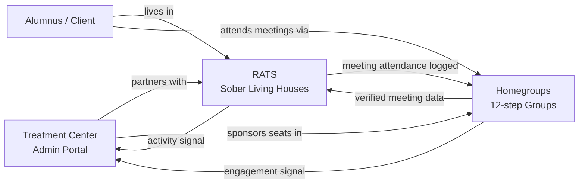

> ⚠️ **Legacy document.** Carried over from the standalone `RecoveryConnect` repository, archived on 2026-06-06. Historical reference only — may be outdated and is NOT part of current `homegroups` documentation.

# RATS + Homegroups — Integrated Offering for Treatment Centers

> **Companion docs:** [01 RATS](./01-rats-sober-living.md) · [02 Homegroups](./02-recoveryconnect-homegroups.md)
> **Audience:** Treatment-center directors of operations, clinical directors, alumni/aftercare coordinators, and the sales team pitching them.

---

## 1. Why a Treatment Center Should Care

The single biggest driver of long-term outcomes after inpatient or residential treatment is **continuity of care**: does the client land in a safe house, and do they actually attend outside 12-step meetings? Treatment centers today have near-zero visibility into either.

Two best-of-breed products already solve the two halves of this problem:

- **RATS** is the system of record for the **sober living house** — where the client sleeps, pays rent, does chores, takes drug tests, and logs activity.
- **Homegroups (RecoveryConnect)** is the system of record for the **12-step group** — where the client actually works a program, has a sponsor, and builds a sober network.

Sold together, they close the loop that matters most to a treatment center: _Is our alumnus showing up — at home and at meetings — 30, 60, 180 days after discharge?_

---

## 2. The Integrated Offering

### 2.1 The three surfaces the center buys

1. **Sober Living network visibility (RATS super-admin tier).**
   Cross-house dashboard for partner sober-living homes. Alumni are placed into a house with one click, and every rent payment, drug test, phase advancement, dispute, and activity entry is visible to the center.

2. **Alumni homegroup engagement (Homegroups facility tier, V4.4).**
   Clients keep using Homegroups after discharge. The center is set up as a _facility_ (via `createIntergroup` + `affiliateGroupToIntergroup` + facility stats) and sees aggregated, privacy-preserving engagement: meetings checked into, milestones hit, sponsorship links formed — never chat content.

3. **A single "continuing care" view.**
   A thin integration layer stitches the two together so a case manager sees one timeline per alumnus: _"Day 47 post-discharge — current at House Bravo, $0 balance, 3 drug tests clean, checked into 14 meetings across 2 homegroups, has a sponsor."_

---

## 3. How the Two Stacks Connect

Both products are built on Firebase (Auth + Firestore + Functions + FCM + Stripe), which makes integration a matter of identity, shared references, and a modest bridge layer rather than a re-platforming.

### 3.1 Identity bridge

- Use a single Firebase Auth tenant (or federated auth with a shared `externalUserId` claim).
- Add a `linkedIdentities` doc keyed by user with `{ ratsGuestId, homegroupsUserId, treatmentCenterAlumnusId }`.
- Custom claims extended to include `facilityId` so Firestore rules on both sides honor facility-level read scopes.

### 3.2 Meeting / attendance bridge

RATS already has a `meetings` concept inside the Activities module. Homegroups owns accurate, geolocated, verified meeting data and a real `checkInToMeeting` callable.

- Point RATS's meeting finder at the Homegroups `findMeetings` callable instead of its legacy meeting list → residents search from one canonical directory.
- When a resident checks in on Homegroups, a trigger writes a RATS `Activity` record of type `meeting` referencing the Homegroups `meetingInstance` ID. That single mirror is the whole integration for day-one value.

### 3.3 Facility dashboard bridge

Both systems already emit the aggregate data the dashboard needs:

| Signal                   | Source                                            |
| ------------------------ | ------------------------------------------------- |
| Rent paid / outstanding  | RATS `stripeEvents` webhook + payment records     |
| Drug test results        | RATS Drug Testing module                          |
| Phase / activity summary | RATS Activities + guest summary                   |
| Meeting attendance       | Homegroups `recordCheckIn` / `checkInToMeeting`   |
| Sobriety milestones      | Homegroups `recordMilestone` + `onMilestoneWrite` |
| Sponsorship formed       | Homegroups `sponsorshipSlice` state + triggers    |

A new Cloud Function (shared deployment or a thin third service) materializes these into a per-alumnus timeline document that the facility dashboard reads.

### 3.4 Payments

Both products use Stripe. Consolidate to a single Stripe platform account with:

- RATS houses as Connect Express accounts (rent flows to them).
- Homegroups groups as subscription customers.
- Treatment center billed centrally for the enterprise tier; they can optionally subsidize the Homegroups $12/yr admin seat for groups at their partner houses.

---

## 4. Sales Narrative

### 4.1 The pitch in one paragraph

_"You already spend marketing dollars to bring alumni back for check-ins that half of them skip. For less than the cost of one readmission avoided per quarter, we give you continuous, structured, privacy-respecting visibility into whether your alumni are housed, paying rent, passing drug tests, and actually working a program — via the same two apps they'd be using anyway. You stop guessing at outcomes and start reporting them to referrers with real numbers."_

### 4.2 Pricing shape (recommended)

| Tier           | Who                                 | What                                                                                                                          | Price anchor                  |
| -------------- | ----------------------------------- | ----------------------------------------------------------------------------------------------------------------------------- | ----------------------------- |
| **Partner**    | Small IOP / single facility         | RATS seats for up to 3 partner houses + Homegroups facility view for alumni who opt in                                        | Per-bed / per-alumnus monthly |
| **Network**    | Mid-size center with alumni program | Unlimited partner houses, facility intergroup, exportable reports, alumni check-in integration                                | Annual platform fee + per-bed |
| **Enterprise** | Multi-site provider                 | Everything + SSO (`configureSSO`), white-label branding, custom data export (`exportIntergroupData`), BAA-style data handling | Annual contract               |

### 4.3 Objection handling

- _"Anonymity concerns — 12-step is anonymous."_ Homegroups is built anonymity-first. The facility sees aggregates and opt-in engagement only; it never sees meeting chat content, sponsor identities, or shares without member consent.
- _"Our alumni won't adopt another app."_ They adopt Homegroups because it's the best free meeting finder and group tool on its own merits. The facility view is a byproduct, not the hook.
- _"We don't run sober livings."_ You don't have to — you designate partner houses. RATS's super-admin tier gives you visibility without operational responsibility.
- _"HIPAA / 42 CFR Part 2."_ Data flows are designed around opt-in consent from the alumnus and aggregate facility reporting. Enterprise tier includes a BAA and data-handling addendum.

### 4.4 Success metrics the center will cite to their board

- % of alumni with a verified bed assignment at day 30 / 90 / 180.
- % of alumni with ≥3 meeting check-ins per week at day 30 / 90 / 180.
- % with a recorded sponsor link within 60 days.
- Drug-test clean rate at partner houses.
- Rent delinquency at partner houses (a leading indicator of relapse).

Each of these is directly derivable from data the two products already produce.

---

## 5. Implementation Roadmap

| Phase                               | Scope                                                                                                                           | Effort                       |
| ----------------------------------- | ------------------------------------------------------------------------------------------------------------------------------- | ---------------------------- |
| **0 — Pre-sales demo**              | Mocked combined dashboard using real RATS + Homegroups data from a pilot house/group pair                                       | 2 weeks                      |
| **1 — Identity + meeting bridge**   | Shared Auth tenant, `linkedIdentities`, Homegroups `findMeetings` wired into RATS, check-in mirror trigger                      | 4–6 weeks                    |
| **2 — Facility dashboard**          | Per-alumnus timeline function, facility web view (can live inside `rats-web` as a new auth-guarded module or as a new thin app) | 6–8 weeks                    |
| **3 — Enterprise polish**           | SSO (`configureSSO`), BAA-grade logging, exportable PDF outcome reports, billing consolidation                                  | 8–10 weeks                   |
| **4 — V4.4 intergroup/facility GA** | Ships Homegroups facility features already on the roadmap; treatment-center tier becomes a productized SKU                      | Aligned with Homegroups V4.4 |

---

## 6. Why This Bundle Wins

- **Both halves are real products, not vaporware.** RATS has an activity + payment ledger in production; Homegroups has 83 callables and a feature-complete MVP.
- **Same tech substrate.** One Firebase project family, one Stripe account, one Auth tenant → integration is plumbing, not replatforming.
- **Privacy-respecting by construction.** Homegroups is anonymity-first; RATS is attributable by design. The treatment center gets aggregates from one side and attributable operations from the other — the exact shape compliance wants.
- **Defensible data.** After six months of a treatment center using the combined dashboard to report outcomes, switching cost is measured in quarters, not weeks.

The sale is not _"buy two apps."_ It is _"buy continuity of care as a managed service, delivered through two apps your clients would use anyway."_
