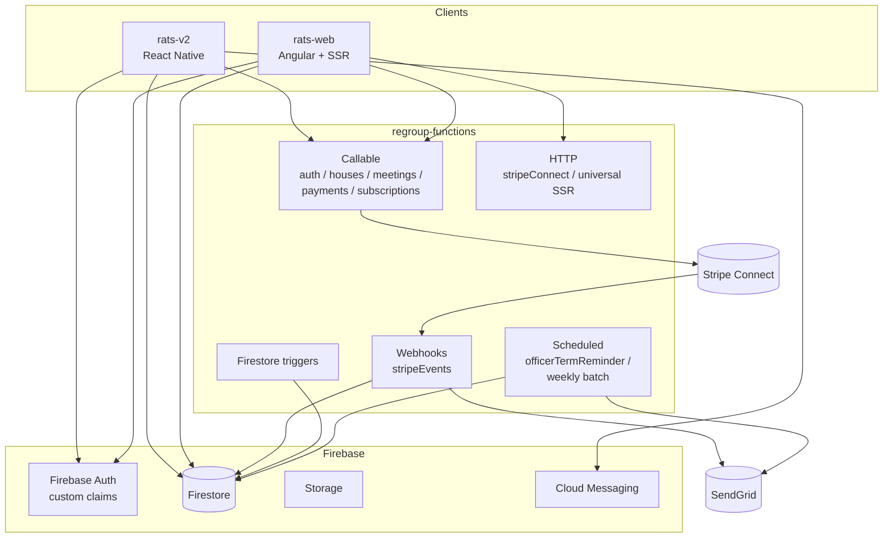

# RATS — Sober Living Operations Platform

> **Product family:** `rats-v2` (mobile), `rats-web` (marketing + web portal), `regroup-functions` (backend)
> **Audience:** Sober living house operators, house managers, residents, and Oxford House chapters.

---

## 1. What RATS Is

RATS (Recovery Activity Tracking System) is a full-stack platform for running sober living homes. It replaces the patchwork of paper binders, group chats, spreadsheets, and Venmo requests that most houses rely on today with a single system of record for residents, compliance, rent, and house governance.

The platform supports two operating models in one codebase:

1. **Manager-operated houses** — a staff owner/manager enforces rules, collects rent, resolves disputes, and signs off on compliance.
2. **Oxford Houses** — democratically self-governed homes with elected officers, weekly business meetings, Equal Expense Share (EES) accounting, and formal voting.

Feature gating by subscription tier (`oxfordEnabled`, admin claims) lets a single deployment serve both audiences.

---

## 2. Value Proposition

| Stakeholder                            | Problem today                                                                                       | What RATS delivers                                                                                                                |
| -------------------------------------- | --------------------------------------------------------------------------------------------------- | --------------------------------------------------------------------------------------------------------------------------------- |
| **House operator / owner**             | Rent collection, compliance paperwork, and incident logs are scattered; liability is hard to prove. | Stripe-powered rent, auditable activity logs, dispute and complaint records, drug-test history — all attributable and exportable. |
| **House manager**                      | Tracking who did chores, attended meetings, worked, or took medication is manual.                   | Unified Activities module with one tap per event; automatic summaries per resident.                                               |
| **Resident**                           | Proving program compliance (meetings, work, supporters, chores) is tedious and adversarial.         | Self-service activity logging on mobile; transparent history they own.                                                            |
| **Oxford House chapter**               | Officer rotation, business meetings, and EES math are done on paper and prone to error.             | Officer roles with term reminders, business-meeting minutes, vote tallying, and automated EES calculations.                       |
| **Treatment center / referral source** | No visibility into whether placed clients are actually engaging.                                    | Admin/super-admin role with cross-house reporting (sets up the integration story in doc 03).                                      |

---

## 3. Feature Set

### 3.1 Core house operations

- **Bed & room management** — house layout, bed assignments, move-in/move-out.
- **Guest (resident) profiles** — personal info, phase, supporters, emergency contacts.
- **Phase advancement** — structured program phases with activity thresholds.
- **Disputes, complaints, issues** — logged, attributable, resolvable.
- **Chores** — assignable, trackable, rotatable.

### 3.2 Activities (unified tracking)

Single model covers meetings, chores, work, medication, and supporter visits. Replaces the legacy "Week/Day" model. Produces per-resident activity summaries used for phase progression and compliance reporting.

### 3.3 Rent & payments

- Stripe Connect Express with destination charges — money moves from resident → platform → house's connected account.
- Payment history, balance dashboard, idempotent payment intents (deduped per guest per UTC day).
- Webhook-driven Firestore payment records and SendGrid receipts.

### 3.4 Drug testing

Test recording, result history, and attribution per resident.

### 3.5 Oxford House governance (gated)

- Elected officer positions with term tracking and expiration reminders.
- Business meetings with minutes and attendance.
- Voting (motion creation, secret/open ballots, atomic tally via Firestore transactions).
- Equal Expense Share (EES) tracker and transfers.

### 3.6 Communication

- Direct messaging between residents, managers, and admins.
- House-wide chat.
- Push notifications (FCM + Notifee) for messages, officer reminders, payment events.

### 3.7 Security & access

- Firebase Auth with custom claims: `guest`, `admin`, `superAdmin`, `potentialSuperAdmin`.
- Two-factor setup flow.
- Sentry error reporting via a centralized `logException()` wrapper.

### 3.8 Billing (web portal)

- Marketing site with six theme variants.
- Account creation, login, password reset.
- Stripe subscription management and billing portal.

---

## 4. Technical Overview

### 4.1 Repos and responsibilities

| Repo                | Role                                         | Stack                                                                         |
| ------------------- | -------------------------------------------- | ----------------------------------------------------------------------------- |
| `rats-v2`           | iOS + Android app for managers and residents | React Native 0.72, TypeScript, Redux Toolkit, React Query, React Navigation 6 |
| `rats-web`          | Public marketing site + web portal           | Angular 9, Angular Universal SSR, Firebase Hosting, ngx-stripe                |
| `regroup-functions` | Shared backend                               | Node 22, Firebase Functions 7, Admin SDK 13, Stripe 20, SendGrid              |

### 4.2 System diagram

### 4.3 Mobile app (`rats-v2`) architecture

- **Provider tree:** `ErrorBoundary → SafeAreaProvider → StripeProvider → ThemeProvider → DataProvider → NotificationProvider → ModalProvider → Auth → RootNavigator`.
- **State:** Redux Toolkit for UI/client state (13 slices); React Query for server state (11 query files).
- **Navigation:** Route names centralized in `src/navigation/types.ts` as a `Routes` enum. Three layers: RootStack (auth/setup/main), AuthStack, MainTabParamList.
- **Service layer:** `src/services/` wraps Firestore reads/writes and Cloud Function calls (`httpsCallable`).
- **Offline resilience:** `offlineQueue.enqueue()` with up to 3 retries on network failure.

### 4.4 Web app (`rats-web`) architecture

- Flat Angular routing with six theme variants for landing pages.
- `AuthGuard` protects account and billing routes.
- Two deployed functions: `universal` (SSR HTTP handler) and `warmWebsite` (per-minute Pub/Sub warmer to avoid cold starts).
- Build requires `NODE_OPTIONS=--openssl-legacy-provider` (Angular 9 + newer Node).

### 4.5 Backend (`regroup-functions`) surface

| Type               | Examples                                                                                    | Notes                                            |
| ------------------ | ------------------------------------------------------------------------------------------- | ------------------------------------------------ |
| Callable           | `createPaymentIntent`, house CRUD, meeting creation, subscription linking, EES calculations | Invoked via `httpsCallable()` from mobile/web    |
| HTTP               | `stripeConnect` OAuth callback, `universal` SSR proxy                                       |                                                  |
| Webhook            | `stripeEvents` (charge succeeded/failed/refunded)                                           | Updates payment records, sends SendGrid receipts |
| Firestore triggers | Guest stats recalculation, meeting record updates                                           |                                                  |
| Scheduled          | `officerTermReminder`, weekly payment/compliance batches                                    | Pub/Sub cron                                     |

Idempotency keys for payment intents are deterministic (`guestId + utcDay`) unless an explicit key is passed. All Stripe errors are mapped to Firebase `HttpsError` with caller-friendly messages.

### 4.6 Data model highlights

- Firestore is the primary store; Realtime Database is legacy and being phased out.
- Role-based access enforced in security rules using custom claims set from Firestore `admin`/`superAdmin` membership.
- Entity interfaces live in `rats-v2/src/entities/` and `rats-web/src/app/entities/` — kept loosely in sync by convention (a shared-types package is a known future consolidation).

---

## 5. Entry Points (for developers)

| Concern         | File                                                        |
| --------------- | ----------------------------------------------------------- |
| Mobile app root | `rats-v2/App.tsx`                                           |
| Mobile routes   | `rats-v2/src/navigation/types.ts`                           |
| Mobile Redux    | `rats-v2/src/state/store.ts`                                |
| Web root module | `rats-web/src/app/app.module.ts`                            |
| Web routes      | `rats-web/src/app/app-routing.module.ts`                    |
| Functions root  | `regroup-functions/functions/src/index.ts`                  |
| Stripe webhook  | `regroup-functions/functions/src/webhooks/stripeWebhook.ts` |
| Payment intent  | `regroup-functions/functions/src/callable/payments.ts`      |

---

## 6. Commercial Positioning

RATS is sold to the house operator, not the resident. Pricing tiers gate:

- Base tier: bed management, activity tracking, communication, Stripe rent.
- Oxford tier: officer/voting/EES modules.
- Enterprise/multi-house tier (prerequisite for the treatment-center integration story): super-admin dashboard across many houses, exportable compliance reports.

The platform's durable competitive moat is the **activity + payment ledger** — once a house runs rent and compliance through RATS for a few months, the switching cost is very high.
